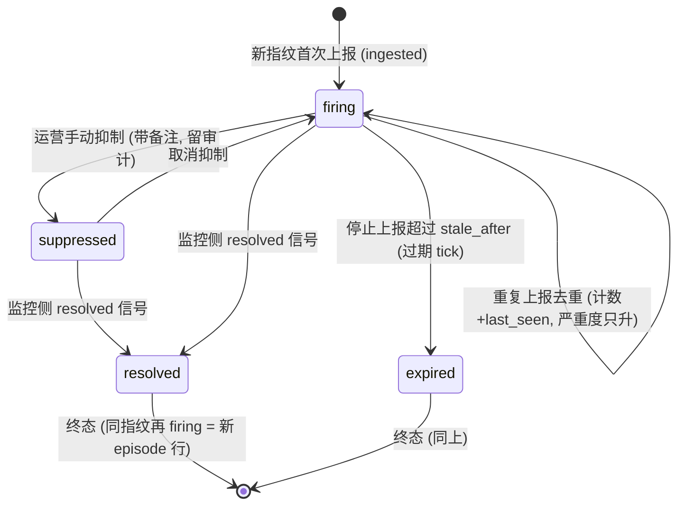

# AIOps 告警域 PRD（aiops_alerts）

> 状态：v0.1 · **评审稿**（未评审通过前不驱动实现）。
> 基线：repo @ `2503616`（2026-08-18，已推 upstream）。
> 上游文档：aiops-platform-reuse-and-roadmap.md（§2.3 告警/CMDB/ITSM 领域，原 P2）、operations-workspace-prd.md（v0.5，§11 非目标边界）。
> 下游文档：p1-aiops-alerts-spec.md（数据模型 + 域规则 + API 契约）。

## 1. 背景与问题

Operations Workspace 控制面已就绪：服务模板、Run 状态机（CAS）、分级审批（SoD、超时永不自批）、飞书通知与试点验证（`840f0f`）、跨副本 SSE。Bayer RFP F6（alert ingestion → intelligent analysis → automated remediation closed-loop）的**控制面证据已实**，但链条的**入口实体缺失**：

- 平台没有告警的代码实体（`aiops_alerts` 全仓 0 命中，roadmap §2.3 明确为"规划中领域模型"）；
- 告警只能停留在飞书群聊语境里，无法被结构化接收、去重、跟踪与关联；
- "告警 → 诊断 Run → 修复动作 → 回写"的闭环没有起点锚，MTTR 类度量无第一米可测。

## 2. 产品定义

**告警域：Operations Workspace 的告警入口与跟踪面。** 以"告警源（Source）"接收监控侧 webhook 上报，以指纹去重合并风暴，以生命周期状态机跟踪每一集（episode），以双向关联接通既有 Run/审批控制面。只做接入与联动，**不重建监控系统、不做告警规则引擎**。

## 3. 目标用户与角色

| 人物 | 职责 | 备注 |
|---|---|---|
| 监控系统（机器） | 经 webhook 上报 firing/resolved | 唯一 resolved 事实源（裁决 3） |
| 运营/SRE | 看告警列表/详情、手动抑制、从告警触发诊断或变更规划 Run | 主用户；Run 侧身份与权限沿用 Operations PRD §3 |
| 审批人 | 处理由告警引发的变更规划 Run 审批 | 复用既有审批服务，无新增角色 |
| 审计员 | 回看告警事件流与关联 Run | 只读；复用 D0 角色模型 |

## 4. 核心用户旅程（首发）

**旅程 1 · 接入**：平台管理员创建告警源（类型 alertmanager/generic，获得一次性展示的 webhook token）→ 配置监控侧 webhook 指向 ingest 端点。

**旅程 2 · 风暴合并**：告警风暴到达 → 同指纹合并为一行（occurrence_count 增长、severity 只升不降、last_seen_at 前移）→ 列表不膨胀，详情可见升级轨迹。

**旅程 3 · 跟踪与闭环**：运营在告警详情查看时间线 → 手动触发"只读故障诊断"或"受控变更规划"Run → Run 走既有审批门 → Run 完成后告警侧可见关联结果（不自动 resolve，裁决 3/6）。

**旅程 4 · 终局**：监控侧 resolved 信号到达 → 告警 resolved（MTTR 停表）；长期无 resolved 且停止上报 → 过期 tick 转 expired（留审计）。

## 5. 阶段范围

| 阶段 | 定位 | 内容 |
|---|---|---|
| **A1** | **域底座（后端闭环）** | 三表迁移（source/alert/event，三方言 + FK=OFF 触发器镜像）、归一化器（alertmanager v2 + generic）、指纹去重、生命周期状态机、过期 tick、ingest 鉴权、审计与度量预埋 |
| **A2** | **工作面（用户闭环）** | Workspace 告警列表/详情页（过滤、时间线、关联 Run）、suppress/unsuppress、手动触发 Run（correlated_run_id 回填） |
| 后续 | 见 §11 | 自动触发规则、auto-resolve 策略、告警 SSE、silence 规则引擎、更多 source 类型 |

## 6. 用户可见告警状态机（episode 语义）

- 一行 = 一集（episode）：resolved/expired 后同指纹再 firing，开**新行**，历史完整保留（裁决 4）；
- `suppressed` 是运营视图动作（静音旧一集），不阻止新 episode 产生；
- `expired` 由后台 tick 驱动（复用超时调度纪律：留审计、幂等、CAS 式条件更新）；
- Run 的触发与完成**不改变**告警状态（只写关联与事件，裁决 3/6）。

## 7. 关键产品需求（PRD 级）

| # | 需求 | 用户感知 |
|---|---|---|
| K1 | 风暴不膨胀：活跃期内同指纹上报合并（occurrence_count / last_seen_at / severity 只升不降） | 一千条风暴 = 一行，升级轨迹可查 |
| K2 | 租户隔离：source token 绑定租户，跨租户 source/告警不可见（负向测试证明） | 别人的告警不会出现在我的列表 |
| K3 | resolved 权威在监控侧：只有监控信号 resolve；平台不猜测、Run 完成不自动 resolve | 终局可信、可审计 |
| K4 | 联动可回溯：告警 ↔ Run 双向可查（correlated_run_id + Run 侧创建上下文携带 source_alert_id） | 从告警进 Run、从 Run 回告警都一跳可达 |
| K5 | 全程审计：append-only `aiops_alert_events`（actor / payload / 时间），去重风暴不逐条刷事件 | 回看不缺席、也不被风暴淹没 |
| K6 | 度量预埋：MTTR（首报 → resolved）、认领延迟（首报 → run_triggered）可从事件 + 计数还原 | P3 看板有第一米数据 |

## 8. SLA / 非功能（建议值，待评审定标）

- ingest 吞吐（main-node 单副本，SQLite）：≥50 req/s，P95 ≤ 200ms（风暴场景以去重合并为路径）；
- ingest 端点幂等：同 payload 重放不产生新 episode、不重复计数（dedup 键 = 指纹）；
- 过期 tick 周期：复用 `OPERATIONS_TIMEOUT_CRON` 同档（每分钟），扫描条件索引化；
- 限流：ingest 端点接入 R9b 限流参数（对齐既有 BFF 限流债的收口方向）。

## 9. 验收标准（标注 A1/A2）

| # | 验收标准 | 阶段 |
|---|---|---|
| 1 | 三方言迁移 + 触发器镜像全量证明（FK=OFF 套件，对齐 0003 迁移纪律） | **A1** |
| 2 | alertmanager v2 payload 归一化落库；1000 条同指纹风暴 = 1 行、occurrence_count=1000、severity 取最高 | **A1** |
| 3 | resolved 后同指纹再 firing = 新 episode 行；suppressed 不拦截新 episode | **A1** |
| 4 | 跨租户 source token 负向证明（错 token 401 / 错租户不可见）；token 仅创建时明文、库存哈希 | **A1** |
| 5 | 过期 tick：stale firing → expired，留审计，幂等重跑不重复迁移 | **A1** |
| 6 | Workspace 告警列表 + 详情（severity/status/source 过滤、时间线、关联 Run 入口） | **A2** |
| 7 | 从告警手动触发诊断/变更规划 Run：走完整审批门，correlated_run_id 回填，Run 完成写 run_completed 事件 | **A2** |
| 8 | suppress/unsuppress 带备注与审计 | **A2** |
| 9 | MTTR / 认领延迟可从事件 + 计数器还原（评测脚本证明） | **A2** |

## 10. 裁决记录（2026-08-18，评审稿待定夺）

| # | 问题 | 提请裁决 |
|---|---|---|
| 1 | 前移合法性：roadmap 将告警域列 P2，为何现在做 | **前移仅限域模型与手动联动**。动因：RFP F6 控制面已实、缺入口实体；自动触发等 P2 语义不随迁（风险封顶） |
| 2 | 工程落位：新建 packages/aiops 还是复用 operations-store | **复用 packages/operations-store**（port/adapter/fake 三方言基座现成，告警与 Run 同库同迁移面）；域膨胀再拆包 |
| 3 | resolved 的权威通道 | **监控侧 webhook 信号唯一**；Run 完成只回写关联事件；auto-resolve-by-run 属 P2 策略引擎项 |
| 4 | 一行一 episode 还是一行一指纹 | **一行一 episode** + 活跃集部分唯一索引 `(tenant_id, fingerprint) WHERE status IN ('firing','suppressed')`；MTTR 按集计算，历史不被覆盖 |
| 5 | 去重风暴的审计粒度 | **节流**：重复 occurrence 只更新计数器，不逐条写事件；事件仅列 §6/§9 目录内类型（ingested/severity_escalated/suppressed/unsuppressed/resolved/expired/run_triggered/run_completed，不设 reopened——新集即新行，裁决 4） |
| 6 | 告警驱动自动触发 Run | **不进本期**（维持 Operations PRD §11 原裁决）；本期仅手动触发，且变更规划 Run 仍过审批门 |
| 7 | ingest 端点鉴权 | **租户级 source token**（创建时一次性明文、库存 sha256）；CF 侧路径豁免 + token 门比照 H-2 模式（豁免面 = POST 单路径，非整树） |
| 8 | 告警实时推送（SSE） | **不进本期基线**；事件目录预留 `alert.*` 类型，P1.x 增强复用 StreamHub（租户粒度房间） |

## 11. 非目标

- 告警规则引擎 / 静默（silence）规则（仅手动 suppress）；
- 告警驱动的自动触发 Run 与 auto-resolve 策略（裁决 3/6）；
- Grafana/Zabbix/PagerDuty 等 source 归一化器（P1 仅 alertmanager v2 + generic）；
- CMDB 资产关联实体（仅 correlation_id 透传）、ITSM 单号闭环（P2/P3 连接器）；
- 告警 SSE 实时推送（裁决 8）；
- 重建监控系统或替代 Alertmanager（平台是接收方不是产生方）。

## 12. 对下游 spec 的输出（本文档评审通过后解冻）

- 三表 schema 与三方言迁移纪律（含部分唯一索引的方言对齐）；
- 指纹算法（labels 规范化 + 易变标签排除表）与归一化器契约；
- 状态机迁移矩阵 + 过期 tick 算法（复用 runOperationsTimeoutTick 工程形态）；
- ingest/list/detail/suppress/trigger-run API 契约与错误信封对齐；
- 审计事件目录与度量预埋字段（MTTR 还原口径）。
