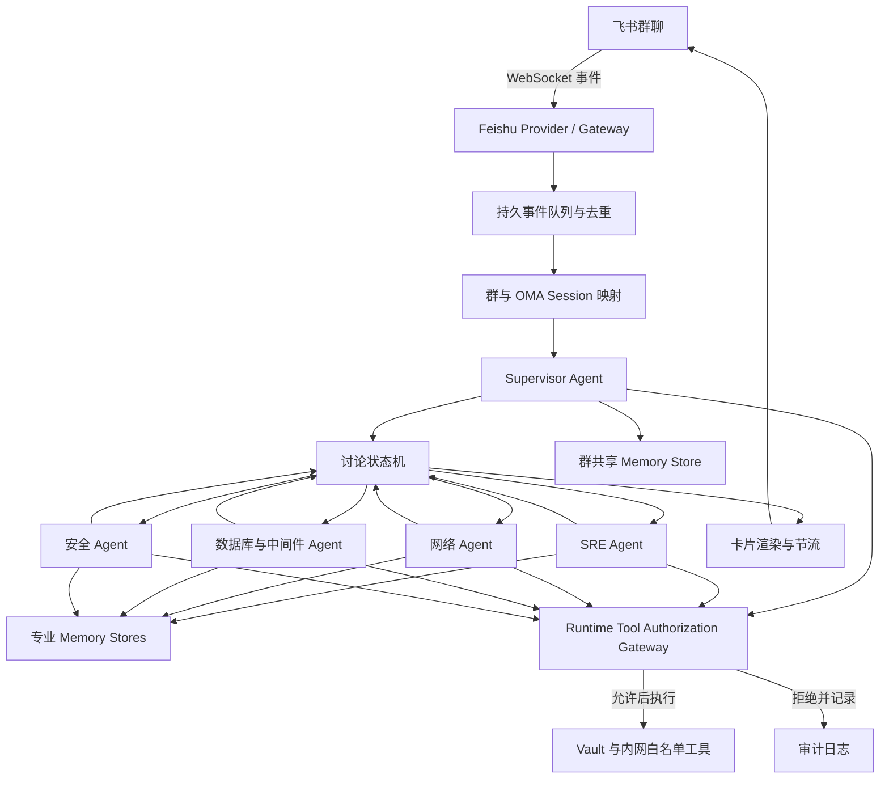

# Product Requirements Document: OMA 飞书运维多数字人协作

**Version**: 1.1

**Date**: 2026-08-11

**Author**: Sarah（Product Owner）

**Quality Score**: 94/100

**Status**: Draft for engineering review

---

## Executive Summary

本项目将在企业内网部署 Open Managed Agents（OMA），并建设原生飞书接入与多数字人协作能力。首期面向几十名运维相关用户和 2–3 个飞书群，通过一个“AI 运维专家团队”机器人承载 5 个可配置数字人。用户在群内 `@AI运维专家团队` 提出问题后，主控 Agent 自动选择参与角色、组织最多 3 轮讨论，并在 2 分钟内输出带角色标识的讨论过程和结构化结论。

首期采用“单 Bot、多数字人”以降低飞书账号管理、机器人消息权限和循环风险。每个群拥有独立共享记忆，每个数字人拥有独立专业记忆；群之间默认隔离。系统只允许访问管理员配置的内网白名单工具，凭据分两层管理（详见 [docs/secrets-design.md](./secrets-design.md)）：平台身份类凭据（飞书 App Secret、模型 provider key、服务间 internal token）由外部 secret manager 注入进程 env，不入 OMA Vault；agent 代用户出站调外部服务所用凭据（如 GitHub、内部 CMDB token）由 OMA Vault 按 hostname 注入、Agent 永不在内存持有明文。两类凭据均不向 Agent 沙箱暴露。

二期在首期稳定运行后扩展为多个真实飞书 Bot 身份。二期复用首期的讨论状态机、消息总线、记忆和审计能力，增加多账号身份路由、Bot-to-Bot 消息接收和更严格的循环控制。

---

## Problem Statement

### Current Situation

- 运维问题通常需要 SRE、网络、安全、数据库/中间件等不同专业视角，依赖人工逐一拉人讨论。
- 讨论信息散落在群聊和个人经验中，难以形成结构化结论和可复用记忆。
- OMA 已具备 Agent、Session、工具、Vault 和 Memory Store 等基础能力，但当前没有飞书 Channel Adapter。
- OMA Node 自部署与 Cloudflare 主线尚未完全对齐：Node 版自定义 Harness、Skill Runtime 和多 Agent 委派需要补齐。
- 直接运行多个飞书 Bot 会引入账号、权限、消息路由和循环控制问题，不适合作为首期方案。

### Proposed Solution

在 OMA Node 自部署环境中增加：

1. 原生 Feishu Integration Provider，使用飞书 WebSocket 长连接接收事件，无需开放公网回调入口。
2. 群聊到 OMA Session 的稳定映射与可恢复事件队列。
3. Supervisor 驱动的多数字人讨论状态机，支持自动选角、并行首轮分析、最多 3 轮讨论和人工停止。
4. 飞书流式卡片渲染，将不同数字人的发言以姓名、头像、颜色和状态区分，但消息发送者仍为同一个飞书 Bot。
5. 群共享记忆、数字人专业记忆、审计记录和管理员治理能力。
6. 补齐 Node 版 Skill、Harness 选择和多 Agent 执行能力。

### Business Impact

- 缩短常见运维问题的跨角色分析和决策时间。
- 将讨论结果沉淀为可审计、可修订、可复用的企业知识。
- 建立可扩展到安全评审、故障复盘和变更评审的企业数字员工基础设施。
- 保持模型、工具、数据和凭据在企业控制边界内。

---

## Goals and Non-Goals

### Goals

- 支持几十名用户、2–3 个飞书群和 5 个数字人稳定使用。
- 80% 的有效讨论在事件被系统接受后 120 秒内生成最终结论。
- 用户只需通过群内 @ 和自然语言即可发起讨论，无需了解 OMA。
- 主控自动选择 2–5 个适合的数字人，也允许用户显式指定角色。
- 讨论最多 3 轮，用户可随时停止、追问或要求重新总结。
- 群共享记忆互相隔离，数字人专业记忆可跨授权群复用。
- 所有外部访问、工具调用、记忆变更和讨论状态均可审计。

### Non-Goals for Phase 1

- 多个真实飞书 Bot 账号互相发言。
- 语音、视频会议或数字人形象动画。
- 自动执行高风险生产变更。
- 任意公网搜索或不受控的软件包安装。
- 大规模向量知识库和通用企业搜索。
- 超过 3 轮的无限自主讨论。
- 取代现有监控、CMDB、工单或变更管理系统。

---

## Success Metrics

### Primary KPIs

- **结论时效**：至少 80% 的有效讨论在 120 秒内生成最终结论。
  - 起点：飞书事件完成鉴权、去重并持久化。
  - 终点：最终结论卡片成功写入飞书。
- **交付成功率**：至少 98% 的已接受讨论最终进入 `completed`、`stopped` 或明确的 `failed` 状态，不允许静默丢失。
- **首轮响应**：95% 的讨论在 5 秒内显示“已受理/正在选择专家”的卡片状态。
- **去重正确率**：重复飞书事件不得创建重复讨论或重复执行工具，目标 100%。
- **隔离正确率**：跨群记忆和对话泄漏事件为 0。

### Secondary Metrics

- 人工停止请求在 3 秒内生效。
- 讨论结束后 30 秒内完成结构化记忆写入或明确记录写入失败。
- 管理员可以定位任意讨论的触发人、参与角色、工具调用、耗时、Token 用量和最终状态。

### Validation

- 上线前使用预定义运维问题集进行不少于 100 次端到端压测和回归测试。
- 试运行 2 周后统计真实讨论的完成时间、失败率、用户追问率和人工停止率。
- 由运维负责人抽样评审至少 30 条结论的可用性和事实准确性。

### 性能基线（2026-08-12 实测）

> 在本地 MiniMax M2.7、三专家并行、两轮讨论及 Supervisor 收口配置下，24 道典型运维问题端到端感知耗时 P95 为 72.38 秒，最大 83.10 秒，120 秒内完成率为 100%，满足"不低于 80% 的讨论在 120 秒内完成并生成结论"的首期目标。

| 指标 | 24 题采样 |
|---|---:|
| 成功率 | 24/24（100%） |
| 感知耗时 P50 / P95 / P99 / max | 57.97s / 72.38s / 80.74s / 83.10s |
| ≤120s 完成率 | 24/24（100%） |
| 专家单轮 P50 / P95 / max | 14.53s / 26.01s / 37.44s |
| Supervisor P50 / P95 | 16.74s / 20.33s |

测量方法与披露（须在正式材料中注明）：

- **未真实调用飞书发送接口**：采样器用 no-op 飞书桩测得"模型+编排"耗时，再固定叠加 3 秒保守估计作为"感知耗时"。该 3 秒为 feishu-echo 实测发送地板的保守上界（多消息可重叠，故略高估）。**生产验收仍需补一轮真实飞书端到端采样。**
- **4 个角色会话跨 24 题复用**：测量包含持续群聊上下文累积，较贴近真实长群使用；新鲜会话的单题耗时会更低（n=1 新鲜会话实测 33.35s）。代价是：若生产中角色会话同样长生命周期（PRD"每群共享记忆"所暗示），上下文会随群历史单调增长，**尾延迟会继续抬升，繁忙群组可能最终突破 120s**——上线前需要上下文管理策略（会话轮换 / 上下文窗口压缩 / 历史上限）。
- **n=24 对 ≥80% 目标的统计支撑**：0 失败，Rule-of-3 给出 P(≤120s) 的 95% 置信下界 ≈ 87.5%，覆盖 80% 目标有余。P95 数值本身是 24 样本下的点估计、区间较宽；"100% 在 120s 内"是稳健结论，"P95 = 72.38s"是参考值。
- 本次属于上方 Validation "不少于 100 次端到端压测" 要求的部分预演（24/100，且为无头而非全链路）。

---

## User Personas

### Primary: 运维工程师

- **Goals**：快速获得多专业视角、定位建议、风险提示和下一步行动。
- **Pain Points**：专家响应时间不一致，群聊讨论缺少结构，历史经验难以复用。
- **Technical Level**：中高级。

### Secondary: 运维负责人/值班负责人

- **Goals**：快速形成处置结论，控制讨论范围，审阅行动建议和高风险操作。
- **Pain Points**：需要手工协调人员和收敛分歧，事后追溯困难。
- **Technical Level**：高级。

### Administrator: OMA 平台管理员

- **Goals**：配置数字人、工具白名单、记忆权限、飞书群范围和审计策略。
- **Pain Points**：担心凭据泄漏、跨群数据污染、失控循环和不可预测成本。
- **Technical Level**：高级。

---

## Digital Personas

首期提供 5 个可配置数字人。以下为默认建议，正式名称和 Prompt 可由管理员调整：

1. **主控/值班指挥 Agent**：理解问题、选择专家、控制轮次、收敛结论。
2. **SRE Agent**：可用性、容量、监控、发布和故障恢复。
3. **网络 Agent**：DNS、负载均衡、网络路径、防火墙和连接问题。
4. **数据库与中间件 Agent**：数据库、缓存、消息队列和存储。
5. **安全 Agent**：权限、凭据、攻击面、合规和变更风险。

主控属于 5 个数字人之一。每次讨论至少包含主控和 1 个专业 Agent，最多包含全部 5 个。

---

## User Stories & Acceptance Criteria

### Story 1: 发起运维讨论

**As a** 运维工程师

**I want to** 在群里 @AI 运维专家团队并描述问题

**So that** 系统自动组织合适的数字人进行分析。

**Acceptance Criteria:**

- [ ] 只有已授权群和用户可以发起讨论。
- [ ] 事件持久化后 5 秒内展示受理状态。
- [ ] 主控自动选择 2–5 个角色，并在卡片中说明选择结果。
- [ ] 用户可以通过自然语言显式指定参与角色。
- [ ] 相同 `message_id` 的重复事件不得重复创建讨论。

### Story 2: 查看多数字人讨论

**As a** 群成员

**I want to** 在一张持续更新的飞书卡片中看到不同专家的观点

**So that** 我可以理解讨论过程和分歧。

**Acceptance Criteria:**

- [ ] 每段发言显示角色名称、头像/图标、轮次和状态。
- [ ] 首轮专家分析默认并行执行，以满足 2 分钟目标。
- [ ] 最多执行 3 轮；达到终止条件后不得继续调用模型。
- [ ] 单个专家失败不阻止其他专家完成，卡片明确显示降级状态。
- [ ] 卡片更新失败时降级为普通富文本消息。

### Story 3: 获取结构化结论

**As a** 运维负责人

**I want to** 获得清晰、可执行且标明风险的最终结论

**So that** 我可以决定下一步处理方式。

**Acceptance Criteria:**

- [ ] 结论至少包含：问题摘要、主要假设、建议检查项、风险、下一步行动和未决问题。
- [ ] 不确定事实必须标注“待验证”，不得伪造监控或系统状态。
- [ ] 涉及生产变更时只能给出建议，不得在一期自动执行高风险操作。
- [ ] 80% 的讨论在 120 秒内发布最终结论。
- [ ] 结论可由用户追问、要求重写或标记为无效。

### Story 4: 控制讨论

**As a** 发起人或运维负责人

**I want to** 停止、追问或限定讨论角色

**So that** 数字人不会无休止讨论或偏离问题。

**Acceptance Criteria:**

- [ ] 用户可通过“停止讨论”按钮或文本命令终止。
- [ ] 停止请求在 3 秒内阻止新的模型/工具调用。
- [ ] 用户追问默认继续当前群 Session，并携带关联讨论 ID。
- [ ] 超过最大轮次后系统必须总结或明确失败，不得自动开始第 4 轮。

### Story 5: 管理记忆

**As an** OMA 平台管理员

**I want to** 查看、修订和删除群记忆与专业记忆

**So that** 长期上下文准确且符合数据治理要求。

**Acceptance Criteria:**

- [ ] 每个群绑定独立的读写 Memory Store。
- [ ] 每个专业 Agent 绑定独立专业 Memory Store。
- [ ] 未授权群无法读取其他群的 Memory Store。
- [ ] 所有记忆修改保留版本、操作者和时间。
- [ ] 管理员可以回滚和 Redact 历史版本。
- [ ] 自动写入记忆前必须过滤凭据、Token 和明显敏感字段。

### Story 6: 管理和审计

**As an** OMA 平台管理员

**I want to** 管理飞书安装、群授权、数字人和工具权限

**So that** 系统可以安全地在企业内部运行。

**Acceptance Criteria:**

- [ ] App Secret 和内部系统凭据加密保存，Agent 沙箱不可读取明文。
- [ ] 可以启用/停用群、数字人和单项工具能力。
- [ ] 可以查询每次讨论的事件、工具调用、记忆写入和失败原因。
- [ ] 禁止非白名单公网访问。
- [ ] 配置变更有审计记录。

---

## Functional Requirements

### FR-1 飞书 Channel 接入

- 使用企业自建飞书应用和应用机器人。
- 默认使用飞书 WebSocket 长连接接收事件，避免暴露公网 Webhook。
- 支持 `im.message.receive_v1`、卡片动作回调和机器人进群/退群事件。
- 验证事件来源、应用身份和群授权。
- 使用 `message_id` 作为业务去重主键；保留 `event_id` 用于审计。
- 接收事件后先持久化再派发，进程重启后可继续处理。
- 维护飞书 `chat_id/thread_id/message_id` 与 OMA Session/Discussion 的映射。

### FR-2 Agent Publication

- 将一个 OMA Supervisor Agent 发布为飞书机器人能力。
- 配置允许的群、用户、数字人名单、默认最大轮次和超时。
- 首期支持一个飞书 Bot 对应多个群；不同群共享 Agent 配置但不共享群记忆。
- Provider 类型新增 `feishu`，并补齐 Node、Cloudflare Schema 类型和 Console 路由；一期运行目标为 Node。

### FR-3 讨论编排

- 讨论状态：`accepted → selecting → discussing → summarizing → completed|stopped|failed`。
- 主控根据问题选择角色，管理员可配置最少/最多参与数量。
- 第一轮专业分析并行执行，后续轮次仅由主控选择需要回应的角色。
- 最大轮次为 3；还需设置总时限、单 Agent 时限和最大 Token 预算。
- 讨论上下文必须包含明确来源，不得将其他 Agent 发言伪装成真实用户输入。
- 每个发言携带 `discussion_id/from_agent/round/correlation_id`。
- 工具调用结果需标注数据来源、时间和失败状态。

### FR-4 飞书呈现

- 单 Bot 消息卡片中为每个数字人配置固定颜色、名称和头像/图标。
- 卡片状态包括：受理、选角、分析中、等待工具、总结中、完成、失败、已停止。
- 支持增量更新；更新频率需节流，避免触发飞书限流。
- 最终结论支持复制、追问、停止和反馈按钮。
- 卡片 API 不可用时自动降级为富文本消息。

### FR-5 Skill

- Node 版实现与 Cloudflare 对齐的 Skill CRUD、版本和文件读取能力。
- Agent 可绑定固定 Skill 版本或 `latest`。
- `SKILL.md` 进入稳定系统 Prompt，附件挂载至 `/home/user/.skills/<name>/`。
- 首期至少提供：故障诊断、变更风险检查、日志分析、结论格式化四类运维 Skill。
- Skill 加载失败必须在审计和管理 UI 中可见，不能静默降级。

### FR-6 Harness

- Node Runtime 必须尊重 `agent.harness` 配置，不再固定使用 DefaultHarness。
- 首期可使用 DefaultHarness 上线，但保留可注册自定义 `ops-supervisor` Harness 的能力。
- `ops-supervisor` Harness 后续可负责角色选择、并行策略、上下文裁剪和结论校验。
- 未知 Harness 必须在配置保存或 Session 创建阶段失败，不得静默回退。

### FR-7 Memory

- 每群一个共享 Memory Store；默认只挂载到该群 Session。
- 每个专业 Agent 一个专业 Memory Store，按 Agent 权限挂载。
- 讨论结束后由主控生成候选记忆，写入以下类型之一：事实、偏好、处置经验、未决问题。
- 原始对话不默认完整复制到长期记忆。
- 记忆包含来源讨论 ID、时间、创建 Agent 和置信/验证状态。
- 管理员可查看、编辑、删除、回滚和 Redact。
- 一期使用文件路径和 `grep/glob`；向量检索不在范围内。

### FR-8 Internal Tool Access

- 工具白名单按 Agent 配置，默认拒绝。
- 白名单必须在两个不可绕过的执行点强制：① `buildTools`/adapter 构造工具集时，仅向模型注册当前 Agent 被授权的工具；② 工具实际分派、产生外部副作用或创建委派 Session 之前，统一经过 Runtime Tool Authorization Gateway 再次鉴权。配置文件、Prompt 或模型输出本身不构成授权。
- Runtime Tool Authorization Gateway 对内置工具、Custom Tool、MCP 工具和 `call_agent_*` 委派工具统一执行默认拒绝；鉴权输入至少包含 Publication、群、用户、Session、调用 Agent、目标 Agent、工具名称、目标系统和动作风险等级。拒绝发生在网络请求、凭据注入或其他副作用之前，并记录结构化审计事件。
- 委派不得扩大权限。创建子 Agent Session 时必须传入显式策略上下文；其有效工具权限取 Publication/群策略、父调用上下文与目标 Agent 白名单的交集。子 Agent 的每次工具调用仍须经过同一个 Runtime Tool Authorization Gateway，不能只校验顶层 Supervisor。
- 仅允许飞书 API、模型服务和已批准内部系统域名。
- 高风险动作工具默认禁用；未来启用时必须支持人工确认。
- Vault 代理负责鉴权头注入，沙箱内不得出现明文凭据。
- 工具返回内容按不可信输入处理，防止 Prompt Injection。

### FR-9 Audit and Operations

- 记录讨论生命周期、模型调用、Token、耗时、工具调用、卡片发送、记忆写入和管理员配置变更。
- 提供按群、用户、Agent、状态和时间查询能力。
- 提供连接状态、队列积压、失败率、P50/P95 时延和飞书限流指标。
- 支持失败重试和人工重新派发，但必须保持幂等。

---

## System Architecture

### Deployment Boundary

- OMA Main Node、数据库、Memory Blob、Vault Proxy、模型网关和内部工具服务均部署在企业内网。
- 飞书 WebSocket 和发送 API 需要受控出站访问飞书官方域名。
- 若使用外部模型 API，需要单独审批；默认目标为企业内部模型网关或经批准的模型出口。
- 建议生产使用 PostgreSQL、对象存储兼容服务和隔离沙箱，不使用默认无隔离 subprocess 处理不可信内容。

---

## Data Model Additions

### Required Entities

- `feishu_apps`：应用 ID、加密密钥引用、域名、状态。
- `feishu_installations`：租户/企业安装信息。
- `feishu_publications`：Agent 发布、Persona、群策略和能力配置。
- `feishu_session_scopes`：`publication + chat/thread` 到 OMA Session 的映射。
- `feishu_deliveries`：事件去重、处理状态、重试次数和错误。
- `discussion_runs`：讨论状态、轮数、预算、耗时和最终结论。
- `discussion_messages`：来源 Agent、轮次、内容引用、关联 ID 和展示状态。
- `feishu_card_states`：卡片 ID、版本、最后更新时间和降级状态。

所有表必须包含租户范围字段、创建/更新时间和必要审计字段。

---

## Technical Constraints

### Performance

- 目标规模：50 名以内用户、3 个群、5 个数字人。
- 支持至少 10 场并发讨论，不发生跨讨论事件混淆。
- 95% 的受理状态在 5 秒内可见。
- 80% 的完整讨论在 120 秒内完成。
- 专业 Agent 首轮默认并行；每个 Agent 设置独立超时。
- 卡片更新实施 500–1000ms 合并窗口，并遵守飞书 API 限流。

### Security

- 企业 SSO/RBAC 用于 OMA Console；飞书侧使用群和用户 Allowlist。
- App Secret、模型密钥和内部系统凭据必须加密保存。
- 沙箱默认无公网访问，仅允许明确白名单。
- 生产环境使用隔离 Sandbox Provider。
- 群记忆、专业记忆和审计数据实施租户及资源级授权。
- 日志不得记录明文 Token、Cookie、Authorization Header 或完整敏感工具输出。
- 高风险运维动作一期仅提供建议，不执行。

### Reliability

- 事件先持久化、后执行。
- 服务重启后恢复未完成事件和讨论。
- 每个外部副作用使用幂等键。
- Agent、工具或卡片单点失败不得导致讨论永久卡在 `running`。
- 超时后必须生成部分结果总结或明确失败原因。

### Technology Stack

- OMA `apps/main-node`、Hono、TypeScript。
- PostgreSQL 作为生产数据库。
- S3 兼容对象存储承载 Memory/File Blob。
- 飞书官方 Node SDK/WebSocket Client。
- OMA IntegrationProvider、Vault、Memory Store 和 Session Runtime。
- React Console 增加飞书管理页面。

---

## MVP Scope & Phasing

### Phase 0: Node Platform Parity

- Node 支持 `agent.harness` 选择和注册表。
- Node 实现多 Agent 委派执行器和 Thread/事件语义。
- Node 实现 Skill CRUD、版本解析、Prompt 注入和沙箱文件挂载。
- 补齐 Memory attachment instructions 和可观测性。
- 建立 PostgreSQL 生产部署、隔离沙箱和测试基线。

### Phase 1: Single-Bot MVP

- 一个飞书应用机器人。
- WebSocket 事件接入、去重和持久队列。
- 2–3 个授权群、几十名授权用户。
- 5 个可配置数字人。
- 主控自动/指定选角、并行首轮、最多 3 轮。
- 流式卡片、停止、追问和最终结构化结论。
- 群共享记忆和数字人专业记忆。
- 内网工具白名单、Vault 注入和完整审计。

**MVP Definition**：用户能够在授权飞书群中通过一次 @ 发起运维讨论，系统在 2 分钟目标内组织多个数字人并交付结构化结论；全过程可停止、可追溯，且不存在跨群记忆泄漏。

### Phase 1.1: Production Hardening

- 负载、故障恢复和长时间稳定性测试。
- 指标、告警、备份和恢复演练。
- Prompt Injection 与权限绕过测试。
- 运维 Skill 和 Persona 调优。
- 试运行反馈闭环和 KPI 仪表盘。

### Phase 2: Multi-Bot Identities

- 每个数字人可绑定独立飞书应用机器人账号。
- 多账号 Token、身份、发送与回调路由。
- Bot 消息接收权限和 `allowBots` 策略。
- 中央消息总线，不依赖飞书回调作为唯一 Agent 间通信通道。
- 最大发言轮次、全局预算、冷却时间和人工熔断。
- 多 Bot 消息与内部 Agent 消息的双重去重。

### Future Considerations

- 运维知识库向量检索与证据引用。
- CMDB、监控、日志、工单和变更系统的只读工具。
- 经人工审批的低风险自动化处置。
- 故障复盘报告和工单自动生成。
- 更多飞书群或部门级多租户运营。

---

## Workload Estimate

### Phase 0 + Phase 1

| Work Package | Estimated Person-Days | Notes |
|---|---:|---|
| Node 多 Agent 委派与 Thread 语义 | 10–16 | 对齐 Cloudflare 主线并补测试 |
| Node Skill Runtime 与 API | 10–16 | 当前 Node `/skills` 为 stub |
| Node Harness 选择与校验 | 5–8 | 注册、选择、失败语义和测试 |
| Memory 指令、隔离与管理补齐 | 5–8 | 群/专业 Store、审计、脱敏 |
| Feishu Provider、安装与凭据 | 10–16 | WebSocket、App、Publication |
| 事件解析、去重、队列和 Session 映射 | 8–14 | 含重启恢复和幂等 |
| 消息/卡片发送与流式更新 | 7–12 | 含限流和富文本降级 |
| 多数字人讨论状态机 | 10–16 | 选角、并行、轮次、终止 |
| Console 管理页面 | 6–10 | 安装、群、Persona、状态 |
| 安全、测试、可观测性和部署 | 15–24 | E2E、压测、告警、恢复演练 |
| **Total** | **86–140** | 含生产化，不含二期多 Bot |

### Calendar Estimate

建议团队：

- 2 名后端/Agent Runtime 工程师。
- 1 名前端/集成工程师。
- 0.5–1 名 QA/测试工程师。
- 运维专家和安全负责人按阶段参与验收。

预计工期：

- 技术 PoC：2–3 周。
- Phase 0 + Phase 1 功能开发：7–10 周。
- 生产加固和试运行：2–4 周。
- **首期总工期：约 9–14 周。**

### Phase 2 Increment

- 多账号和真实 Bot 身份：8–12 人日。
- Bot-to-Bot 权限与事件处理：5–8 人日。
- 消息总线、循环控制和成本熔断：8–14 人日。
- Console、测试和安全加固：8–12 人日。
- **二期增量：约 29–46 人日，4–7 周。**

估算基于当前仓库状态和现有 Slack Provider 的复杂度。工程评审后允许 ±20% 调整。

---

## Risk Assessment

| Risk | Probability | Impact | Mitigation Strategy |
|---|---|---|---|
| Node 与 Cloudflare 能力差异大于预期 | High | High | Phase 0 单独验收；先补 Runtime 测试再开发飞书 |
| 2 分钟目标受模型或内部工具延迟影响 | Medium | High | 首轮并行、每 Agent 超时、部分结果总结、模型分层 |
| 飞书事件重复或重连造成重复执行 | Medium | High | `message_id` 去重、持久队列、所有副作用使用幂等键 |
| 卡片更新触发限流 | Medium | Medium | 合并增量、限频、退避和富文本降级 |
| 数字人讨论循环或成本失控 | Medium | High | 最大 3 轮、总时限、Token 预算、人工停止和熔断 |
| Prompt Injection 诱导调用内部工具 | High | High | 白名单、最小权限、输出净化、高风险动作禁用 |
| 群记忆跨边界泄漏 | Low | Critical | 资源级授权、独立 Store、负向隔离测试 |
| 自动记忆写入错误事实 | Medium | High | 来源、验证状态、管理员修订、版本回滚 |
| 飞书权限审批或企业策略阻塞 | Medium | Medium | PoC 首周完成应用、权限和 WebSocket 连通验证 |
| 多 Bot 二期触发机器人消息循环 | Medium | High | 中央总线、来源标记、TTL、轮次和全局熔断 |

---

## Dependencies & Blockers

### Dependencies

- 企业飞书自建应用创建权限和所需消息/卡片权限。
- 内网到飞书官方 API 的受控出站网络。
- 可用的模型服务或企业模型网关。
- PostgreSQL、对象存储和隔离沙箱运行环境。
- 运维专家提供 Persona、Skill、测试题集和结论模板。
- 安全团队确认凭据、网络白名单和审计保留策略。

### Known Blockers

- Node 当前固定使用 DefaultHarness，需要实现 Harness 注册和选择。
- Node `/v1/skills` 当前为空 Stub，需要实现完整 Skill 路由和 Runtime。
- Node `buildTools` 当前未注入多 Agent 委派执行器。
- OMA Integration `ProviderId` 当前只包含 Linear、GitHub、Slack，需要增加 Feishu 并更新相关类型和 wiring。
- 生产环境不能使用默认无隔离 subprocess 处理来自群聊的不可信输入。

---

## Test Strategy

### Unit Tests

- 飞书签名、事件解析、@ 提取、卡片动作和消息格式。
- 角色选择、轮次推进、预算、停止和超时状态机。
- Session scope key、群隔离和事件去重。
- Memory 脱敏、版本、权限和来源元数据。

### Integration Tests

- 飞书事件 → Session → 多 Agent → 卡片完整链路。
- WebSocket 断线重连、重复事件和服务重启恢复。
- Agent 超时、工具失败、卡片限流和模型异常。
- Node Harness、Skill 和多 Agent 功能回归。

### Security Tests

- Prompt Injection、越权工具、跨群 Memory、凭据泄漏。
- 未授权用户/群、伪造事件和重放事件。
- 日志敏感字段扫描。
- 沙箱网络逃逸和非白名单访问。
- 伪造或直接注入未注册、非白名单的内置/Custom/MCP `tool_call`，必须在任何网络请求、凭据注入和副作用发生前被 Runtime Tool Authorization Gateway 拒绝，并产生包含拒绝原因的审计事件。
- Supervisor 委派给子 Agent 后，伪造子 Agent 调用其自身白名单外或父级上下文未授权的工具，必须被拒绝；验证子 Agent 有效权限严格等于 Publication/群策略、父调用上下文与目标 Agent 白名单的交集。
- 验证构造期裁剪和运行期鉴权相互独立：即使绕过工具可见性过滤或构造伪造调用，运行期仍拒绝；即使运行期策略允许，未注册工具也不能出现在模型工具集中。
- 对拒绝路径断言内部工具服务零调用、Vault 零凭据注入、Memory 零写入，并验证重试、重放和并发委派不能绕过策略。

### Acceptance Test Set

- 服务不可用诊断。
- 延迟升高分析。
- 网络连接异常。
- 数据库性能异常。
- 发布后故障。
- 权限/凭据异常。
- 信息不足、相互矛盾和恶意提示场景。

---

## Launch Plan

1. 开发环境完成飞书 WebSocket 和单 Agent 回声 PoC。
2. 补齐 Node Platform Parity 并通过自动化测试。
3. 接入 5 个数字人和讨论状态机。
4. 在 1 个测试群进行内部验证。
5. 完成 100 次端到端基准测试和安全测试。
6. 扩展到 2–3 个目标群，进行 2 周灰度试运行。
7. 复核 KPI、误用、成本和记忆质量后正式上线。
8. 首期稳定运行 4 周后评审是否启动多 Bot 二期。

### Rollback Criteria

- 发生跨群数据泄漏或凭据泄漏。
- 重复执行导致内部系统副作用。
- 连续 24 小时交付成功率低于 95%。
- 无法通过配置禁用高风险工具或停止讨论。

发生上述情况时立即停用对应 Publication 或整个 Feishu Provider，保留审计数据并回滚至上一稳定版本。

---

## Open Decisions for Engineering Review

- 5 个数字人的正式名称、Prompt 和工具权限矩阵。
- 生产沙箱选择：LiteBox、Daytona、E2B 或内部实现。
- 模型网关和每个数字人的模型/成本配置。
- Memory 和审计数据的保留期限。
- 是否在首期实现专用 `ops-supervisor` Harness，或先以 DefaultHarness + Skill 上线。
- 飞书管理 UI 是完整原生页面，还是首期采用管理员配置文件/CLI。

---

## Glossary

- **Supervisor**：负责选角、轮次控制和总结的主控数字人。
- **Discussion Run**：由一次群聊请求触发的完整多数字人讨论实例。
- **Publication**：将 OMA Agent 发布到某个外部平台的配置实体。
- **Session Scope**：外部会话与 OMA Session 的稳定映射。
- **Group Memory**：仅对一个飞书群授权的共享 Memory Store。
- **Professional Memory**：属于某个专业数字人的长期 Memory Store。
- **Single-Bot Multi-Persona**：一个真实飞书 Bot 在内容中展示多个数字人身份。
- **Multi-Bot**：多个真实飞书应用机器人分别代表不同数字人。

---

## References

- OMA project README and architecture documentation.
- `packages/integrations-core` IntegrationProvider contract.
- Existing `packages/slack` provider and integration tests.
- OMA Harness, Skills, Memory Store and Dreams implementations.
- Feishu Open Platform message events, WebSocket, card and bot-message permissions documentation.

---

*This PRD was created through interactive requirements gathering with quality scoring to ensure comprehensive coverage of business, functional, UX, and technical dimensions.*
