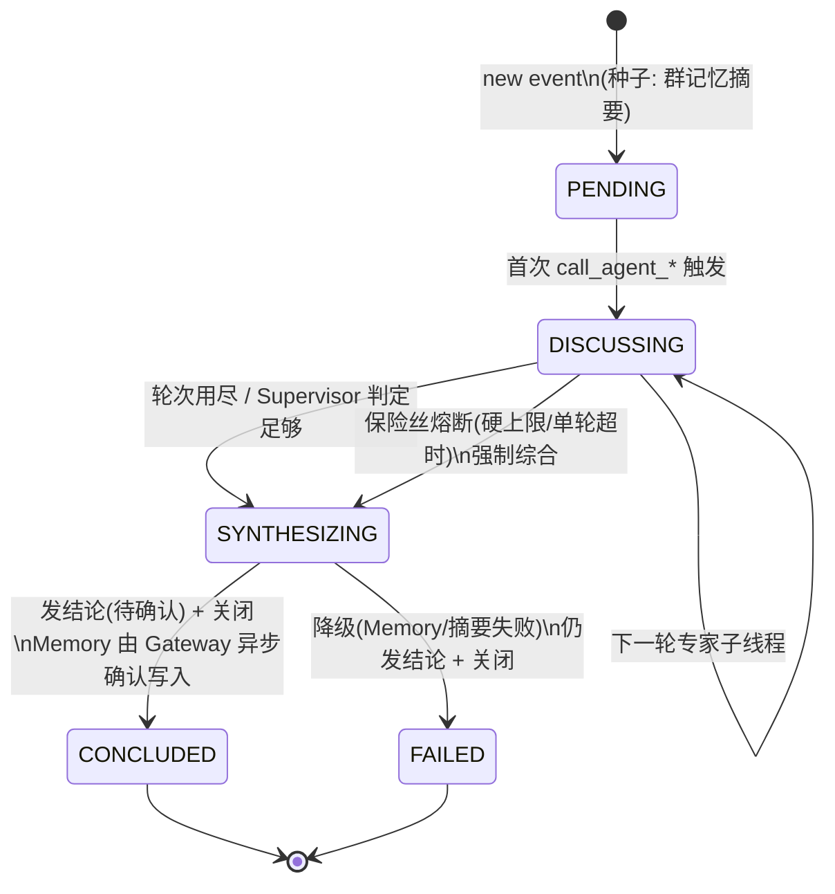

# 飞书多智能体：Session 生命周期与上下文管理策略

**Date**: 2026-08-12
**Status**: Draft for engineering review（纯设计，不动 core、不 commit）

> 配套阅读：性能基线与 SLA 模型见
> [feishu-multi-agent-integration-prd.md](./feishu-multi-agent-integration-prd.md) 的「性能基线」节；
> 私有化秘钥分层见 [secrets-design.md](./secrets-design.md)。本文不重复这两篇，只解决一个问题：
> **群共享记忆与长期复用 Session 是两件事，必须解耦。** 本文定稿后再进入 Phase 0 原生委派 SDS。

---

## TL;DR

n=24 采样（[spikes/feishu-triage/src/sample.ts](../spikes/feishu-triage/src/sample.ts)）在「4 个角色
Session 跨 24 题复用」的跑法下测得 P95 72.38s。这套跑法把两件事绑死了：

1. **群共享记忆**（想让群越用越聪明，长期保留）
2. **Session 长期复用**（同一个 Session 对象一直跑下去，主线程上下文越堆越长）

绑定后的代价：**Supervisor 主线程**上下文随群龄单调增长 → 单轮延迟 T 随之增长 → P95 随群龄上升 →
活跃群迟早击穿 120s SLA。这正好是验收标准 #2（≥100 事件后 P95 不随群龄上升）要禁止的形态。

> 机制依据：OMA 原生委派每次 `call_agent_*` 生成一个新子**线程**（`sthr_*`），它有独立的
> `InMemoryHistory`（不继承该专家上轮历史），但与 Supervisor **共用 SessionDO / sandbox / 租户 / 父事件
> 日志**（见 §9.2）。所以真正长期增长的对象是 **Supervisor 主线程**，不是每次新建的专家线程。

**推荐方案：把两者拆开。** 群记忆走 Memory Store（长期、精选、由 Gateway 确认写入）；Session 改为
**事件级**（短命、一个运维事件一个 Supervisor Session；专家委派在同 Session 内开新子线程，天然用完即
弃）。新事件只注入结构化记忆摘要，不注入历史聊天。这与 OMA 原生 `callable_agents`「每次委派新建子线程」
的机制（见 §9）天然契合。

一句话：**Memory 长寿，Session 短命。Session 是工作上下文窗口，不是记忆库。**

---

## 1. 策略对比

| | A. 永久角色 Session | B. 滚动轮换 | **C. 事件级 Session + Memory 沉淀（推荐）** | D. 单 Session + 滑窗摘要 |
|---|---|---|---|---|
| Supervisor 主线程寿命 | 永久（每群 4 个） | 每 N 事件轮换 | **每事件新建** | 单 Session 长跑 |
| 专家委派形态 | — | — | **同 Session 新子线程（sthr_*）**，用完即弃 | — |
| 群记忆载体 | Session 主线程历史 | 轮换后只剩「幸存」内容 | **Memory Store 精选记录** | 滚动摘要 |
| 上下文随群龄 | 主线程单调增长 ❌ | 有界但信息丢在边界 | **有界（事件级）** ✅ | 缓慢增长（摘要+窗口） |
| 信息保留可控性 | 不可控（截断随机丢） | 不可控（轮换丢） | **可控（Gateway 显式沉淀）** ✅ | 半可控（摘要漂移） |
| 与 OMA 原生委派契合 | 否 | 否 | **是（每次委派子线程）** ✅ | 否 |
| 复杂度 | 最低 | 低 | 中（需事件分类器 + 确认通道） | 中 |
| SLA 随群龄 | P95 上升 ❌ | 平但丢信息 | **平且信息受控** ✅ | 略升 |

**选 C 作主生命周期，D 的滑窗摘要作为「单事件过长」时的第二道控制。** A 是 n=24 采样意外踩中的反模式；
B 的「轮换即丢信息」不可接受；D 单独用会让记忆与 Session 仍耦合、且摘要持续漂移。

> 决策依据：n=24 基线里 P50 ~58s 显著高于 n=1 fresh-session 的 33.35s，根因就是 Supervisor 主线程
> 复用堆上下文。任何「主线程长寿」的方案都会重现这条曲线。把 Supervisor Session 缩到事件级，T 分布就
> 回到 fresh-session 形态。

---

## 2. 推荐架构

三层状态显式分离，加一个跨切面分类器：

```
飞书群消息
   │
   ▼
┌──────────────────────────┐
│  事件边界分类器            │  new / follow-up / reopen
│  （网关侧，aux_model）     │
└───────────┬──────────────┘
            │ new event
   ┌────────▼─────────────────────────────────────────────┐
   │  Event Session (Supervisor 主线程 sthr_primary)        │  ← 事件级，短命
   │  种子：群记忆摘要 + 本题（按 Token 上限构造，见 §6.6） │
   │  ┌──────────────────────────────────────────────┐    │
   │  │ round 1: call_agent_* × 3 → 各开 sthr_* 子线程│    │
   │  │   ┌────────────┐ ┌────────────┐ ┌──────────┐ │    │  ← 每委派新建子线程
   │  │   │ Expert thrd│ │ Expert thrd│ │ Expert…  │ │    │    独立 InMemoryHistory
   │  │   │ own history│ │ own history│ │          │ │    │    共用 SessionDO/sandbox/
   │  │   └────────────┘ └────────────┘ └──────────┘ │    │    tenant/父事件日志
   │  │ round 2: 同上（Supervisor 把 round-1 意见喂回）│   │
   │  │ Supervisor 综合 → 结构化「待确认结论」         │    │
   │  └──────────────────────────────────────────────┘    │
   └───────────────────────┬──────────────────────────────┘
                           │ 待确认结论（不下沉沙箱）
                           ▼
              ┌────────────────────────┐
              │  Feishu Gateway         │  人工/规则确认 → Memory REST API（CAS）
              │  自持：事件/群/Session  │  记录 event_id/group_id/确认者/source_session
              │  关联 + 业务确认状态表  │
              └─────────────┬──────────┘
                            ▼
              ┌────────────────────────┐
              │  Group Memory Store     │  ← 长期，一群一份
              │  只存：确认事实/结论/处置│     精选、可归属、可纠正
              │  不存：原始群聊          │
              └────────────────────────┘
                           │
              新事件读取 ──┘ （注入筛选后摘要，不注入历史）
```

**关键解耦**：群记忆长寿 ≠ Supervisor 主线程长寿。群记忆永久（Gateway 确认后才入库）；Supervisor Session
事件级（用完即关）。分类器输出 `reopen` 时**不复活旧 Session**，而是新建一个、把旧事件的结构化摘要当
种子——这是把上下文钉在事件级的根本手段。

> 专家子线程**不直接写群 Memory**：子线程共享 Supervisor 的 sandbox（见 §6.2 风险），Memory 写入只能经
> Gateway 的确认通道（§6.1）。这是 C 方案能在共享沙箱模型下安全落地的关键。

---

## 3. 生命周期状态机

### 3.1 Supervisor Session（本文重点）



**状态语义：**

| 状态 | 含义 | 可否继续接 turn |
|---|---|---|
| `PENDING` | 已建 Session，等首轮专家 | 是（follow-up 直接进 DISCUSSING）|
| `DISCUSSING` | 专家子线程在跑 / 多轮进行中 | 是（同事件 follow-up）|
| `SYNTHESIZING` | Supervisor 产出待确认结论 | 是（短窗口内）|
| `CONCLUDED` | 已发结论 + 已关闭（Memory 由 Gateway 异步确认）| **否（终态）** |
| `FAILED` | 降级完成，发了部分结果 + 已关闭 | **否（终态）** |

**铁律：`CONCLUDED` / `FAILED` 的 Session 永不复活。**「reopen」永远建新 Session，把旧事件结构化摘要当
种子。这是上下文有界的制度保证。

**休眠窗口（follow-up 识别）：** 结论发出后保留 `DORMANT` 视角 10 分钟——这 10 分钟内分类器判为
follow-up 的消息继续用当前 Session（仍在 `SYNTHESIZING` 附近）；超过 10 分钟判为 follow-up 的，按
reopen 处理（新建）。10 分钟是初始值，由 §8 的 `session.dormant_reopen_rate` 校准。

### 3.2 Expert 子线程（`sthr_*`，同 Session）

```
call_agent_* 创建 → RUNNING → (返回意见字符串) → CLOSED/丢弃
```

- **一次性**：每次 `call_agent_*` 都 `new InMemoryHistory()`
  （[apps/agent/src/runtime/session-do.ts:3987](../apps/agent/src/runtime/session-do.ts)），**不继承该专家上轮
  历史**，也不继承 Supervisor 主线程历史。多轮讨论靠 Supervisor 把上轮意见作为 `message` 喂回。
- **无休眠、无 reopen**：子线程返回即弃。
- **不拿 schedule 工具**（session-do.ts:4020-4029 的注释——子线程注入的定时唤醒会落到父 Session 主流，
  被不同模型/prompt 的 Supervisor 看到，行为错乱）。这正好是「专家只做单轮研判、不持有任何长期状态」的
  语义。
- **共享 SessionDO / sandbox / 租户 / 父事件日志**（session-do.ts:3961 子线程挂到同一 SessionDO；sandbox
  per-session，见 §6.2）。

> 因此「专家上下文无限增长」是伪命题——子线程每次全新。真正需要控制增长的是 **Supervisor 主线程**，
> 即 §3.1 的事件级生命周期 + §5 的滑窗。

---

## 4. 事件边界识别（分类器）

分类器在网关侧、Session 分发前运行，判三类：

| 输入特征 | new event | follow-up | reopen |
|---|---|---|---|
| 与当前**开放**事件语义关系 | 无关 | 相关 | — |
| 当前是否有开放事件 | 否（或都关了） | 是 | 否（已 CONCLUDED） |
| 距上次消息时间 | — | ≤ 10 min | > 10 min，或明确引用旧事件 |
| Session 动作 | 新建 Supervisor Session | 继续当前主线程 | **新建**，种子=旧事件摘要 |

**实现路径（由便宜到贵）：**
1. **启发式**：@reply 同飞书消息线程 / 时间窗 / 关键词命中当前事件题面 → follow-up。零成本，先上。
2. **aux_model 兜底**：启发式不确定时，用 `aux_model`（AgentConfig 已有此字段，
   [packages/api-types/src/types.ts:71-77](../packages/api-types/src/types.ts)）做一次轻量分类，对比「新消息」
   vs「当前开放事件题面 + 末轮」vs「近 N 个已结事件的标题」。成本远低于一个专家轮。
3. **失败默认**：分类器抛错 → 默认 `new event`（安全：新建 Session，零上下文污染）。

> 子 Agent 的 `aux_model` 已是 OMA 既有字段，复用它做分类不引入新依赖。

---

## 5. 摘要触发条件（第二道控制，仅作用于「单事件过长」）

主生命周期（事件级 Supervisor Session）已让常规事件上下文有界。摘要只在**单个事件内部**撑长时介入，
保护「同一事件两轮不丢关键上下文」（验收 #1）的同时防止极端事件炸 Supervisor 主线程上下文。

| 触发器 | 阈值（初始值，由验收 #2 的 ≥100 事件模拟校准） | 动作 |
|---|---|---|
| **轮次触发** | 事件超过 **3 轮**（默认 2 轮） | 压缩第 1 轮为摘要后再开第 4 轮 |
| **Token 触发** | 主线程单轮工作上下文 > **40K tokens** | 压缩最旧轮次（保留最近 2 轮完整） |
| **延迟趋势触发** | 本事件单轮 P50 > 首轮延迟的 **1.5×** | 上下文在膨胀，触发压缩 |
| **硬上限（保险丝）** | 主线程工作上下文 > **60K tokens** | 强制压缩到 2 轮窗口，降级到截断 |
| **单轮超时（保险丝）** | 专家单轮 **45s** / Supervisor 单轮 **35s** | 熔断，跳过该轮，进 SYNTHESIZING |
| **事件墙钟（保险丝）** | 事件总计 **110s 软告警 / 115s 硬上限** | 强制用已有意见综合（哪怕 0 专家意见） |

**阈值依据（n=24 基线）：**
- 专家单轮 max 37.44s（SRE 尾 P95 31.95s）→ 45s 留 ~20% 余量，只熔真异常。
- Supervisor P95 20.33s → 35s 余量充足。
- 感知 P95 72.38s / max 83.10s / SLA 120s → 115s 硬上限留 ~5s 给飞书发送（实测 ~3s）。
- Token 阈值（40K/60K）是**初始猜测**，显式标注待校准——它们是验收 #2 调参的主旋钮。

> 滑窗摘要**只**压「同事件内 Supervisor 主线程的旧轮次」，**不**跨事件。跨事件的记忆交接走 §6 的
> Memory Store，不走摘要。

---

## 6. 群 Memory 写入规则（什么沉淀、谁确认、怎么安全写）

### 6.1 写入通道：由 Gateway 控制，不靠沙箱约定

> **写入规则：群 Memory 只能由 Feishu Gateway 在「人工确认或规则确认」后，通过 Memory REST API 写入。**
> Supervisor 在 `SYNTHESIZING` 阶段产出结构化「待确认结论」，但**不直接落库**；专家子线程更不直接写。

写入路径：

```
Supervisor 综合产出「待确认结论」(结构化 JSON)
        │
        ▼
Feishu Gateway（人工 @confirm 或规则确认，如 ≥2 专家一致）
        │  Memory REST API（CAS: WritePrecondition etag）
        ▼
Group Memory Store  ← 记录 event_id / group_id / 确认者(actor) / source_session_id
```

- **CAS**：用 `WritePrecondition`（etag，
  [packages/memory-store/src/types.ts:56-58](../packages/memory-store/src/types.ts)）防并发覆写。
- **归属**：每条写入带 `event_id`、`group_id`、确认者（`actor.type=user` 或 `system`）、`source_session_id`
  （产出的 Supervisor Session）。
- **REST 走外网鉴权**：这一步是 Gateway 的自身身份调用（Tier 1 自举凭据，见
  [secrets-design.md](./secrets-design.md)），不进 sandbox，专家线程够不着。

### 6.2 为什么不能靠「约定只有 Supervisor 写」

**CF 子线程共享 Supervisor 的 sandbox**（session-do.ts:275「one sandbox per session」）。如果群 Memory 以
**读写方式挂载**进 sandbox，而专家线程拥有 `bash` / `write` / `edit` 工具，专家**理论上能直接改
Memory 文件**——「只有 Supervisor 写」只是约定，沙箱层不强制。确认语义决不能建立在这种约定上。

首期最稳的设计（与 §6.1 配合）：
- 讨论期间，专家**只读**经过 Supervisor 筛选的群知识（经委派 `message` 注入相关切片，或只读挂载）。
- 群 Memory **不以可自由写入的形式暴露给专家**。
- 写入只走 §6.1 的 Gateway REST 通道，物理上离开 sandbox。

### 6.3 白名单（只存这三类）

| 类型 | 例 | 确认条件 |
|---|---|---|
| **确认事实** | 「服务 X 于 <时间> CPU 95%，根因 Y」 | ≥2 专家一致，或专家 + 工具验证 |
| **结论** | 事件最终结论 + 置信度 | Supervisor 综合产出 + Gateway 确认 |
| **处置记录** | 做了什么、谁做的、结果 | Supervisor 产出或人工 @confirm |

### 6.4 黑名单（绝不入库）

- 原始群聊 / @mention / 寒暄（验收 #5 的硬要求）。
- 未确认的单专家假设、被否的猜测。
- PII / 秘钥（Supervisor 必须剥离；与 [secrets-design.md](./secrets-design.md) 一致——别让本该在 vault
  或本不该存在的秘密进了群记忆）。
- 瞬态状态（「排查中…」。

### 6.5 业务确认状态 ≠ `redacted/version`

`MemoryVersionRow.redacted`（[packages/memory-store/src/types.ts:40-54](../packages/memory-store/src/types.ts)）
是**纠错/审计**机制（事后发现错误 → 写新版本、旧版本 `redacted=true`），**不等于业务确认状态**。两者分
开：

| | `redacted/version`（Memory Store 自带） | 业务确认状态（Gateway 自持） |
|---|---|---|
| 语义 | 这条记忆被新版本取代/撤回 | 这条「待确认结论」是否已通过确认 |
| 存哪 | Memory Store 的 version 行 | Gateway 自己的表（`memory_confirmations` 之类） |
| 谁写 | Memory REST API（CAS） | Gateway 确认流程 |

> v1 不需要给 Memory Store 加 `status` 列——业务确认状态由 Gateway 的表维护，Memory Store 只存「已确认
> 入库」的内容。v2 若要支持「草稿态记忆在沙箱内可见」，再考虑加列。

### 6.6 新事件读取与 Prompt 上限（跨事件召回，验收 #4）

**读取**：新事件建 Supervisor Session 时，把群 Memory Store **绑定到该 Session**；专家子线程**不**绑定
群 Memory（只通过委派消息拿到 Supervisor 筛过的相关切片），保持子线程上下文最小。

**Prompt 上限（验收 #3）——必须作为独立策略，不能借用 `4096`：**

`MEMORY_STORE_INSTRUCTIONS_MAX_CHARS = 4096`
（[packages/memory-store/src/types.ts:65](../packages/memory-store/src/types.ts)）**只限制绑定 Memory Store
时的 `instructions` 字段长度**，不限制：

- Supervisor system prompt；
- 当前事件题面与轮次意见；
- 主线程历史消息；
- Memory **文件内容**（单文件上限实际是 `MEMORY_CONTENT_MAX_BYTES = 100KB`，≈25K tokens，types.ts:61）；
- 模型最终上下文。

而且挂载的 Memory 文件**不会自动全部注入 Prompt**。因此「新事件 Prompt 上限」必须是**独立策略**：
Gateway 或 Harness 在构造 Supervisor 主线程种子上下文时，按 **Token 预算**（如「群记忆摘要 ≤ X tokens」
+ 题面 + 预留 2 轮窗口）强制截断/筛选。**这个 Token 预算是验收 #3 的真正落点**，初始值随 §5 的 40K/60K
一起由 ≥100 事件模拟校准。

> 群 Memory 总量用保留策略约束（如每群保留最近 N=200 条，旧的归档）。

---

## 7. 失败降级

**原则：用户永远在 SLA 内收到回复；牺牲记忆准确度先于牺牲可用性。** 验收 #6（摘要或 Memory 失败仍
完成当前事件）逐级落地：

| 故障 | 降级动作 | 事件是否完成 | 指标 |
|---|---|---|---|
| Memory 读失败（事件开始） | Supervisor 用空记忆种子照跑（事件对历史失明） | ✅ | `memory.read_failed` |
| Memory 写失败（Gateway 确认后落库） | 照发结论，写异步重试队列 / 丢并记日志 | ✅ | `memory.write_failed` |
| 滑窗摘要 LLM 失败 | 降级为**截断**（丢 2 轮窗口外的旧轮，不生成摘要） | ✅ | `summary.fallback_truncate` |
| 专家子线程抛错 | 该专家本轮缺位，Supervisor 用其余专家继续；3 个全挂 → Supervisor 单 Agent 兜底 | ✅ | `expert.delegate_failed` |
| 硬上限 / 单轮超时熔断 | 用手头意见（哪怕 0 专家）强制综合，必发处置 | ✅ | `fuse.tripped` |
| 分类器失败 | 默认 `new event`（新建 Session，零污染） | ✅ | `classifier.default_new` |

> Memory 写失败只影响「群学习」，不影响当前事件回复——因为写入本就是 Gateway 在事件 CONCLUDED 之后
> 异步做的（§6.1）。这天然满足验收 #6 的「Memory 失败仍完成当前事件」。

---

## 8. 可观测指标

| 类别 | 指标 | 用途 / 关联验收 |
|---|---|---|
| **SLA** | `event.wall_clock_ms` P50/P95/P99 | 对 120s SLA；延续 n=24 基线 |
| | `turn.latency_ms`（按 supervisor/sre/network/security 拆） | 定位角色尾 |
| | `fuse.tripped_count` | 稳态应 → 0 |
| **上下文** | `supervisor_main_thread.input_tokens` 每轮 | 主膨胀信号（真正该盯的对象） |
| | `session.context_tokens_at_close` | 事件结束时的主线程上下文体积 |
| | `memory.injected_instructions_chars` | 绑定 Memory 时注入的 instructions 字段（≤4096）|
| | `seed_prompt_total_tokens` | 新事件种子 Prompt 总 Token（验收 #3 的实测值，对 §6.6 预算）|
| **压缩** | `summary.invocations` 每事件 | 滑窗触发频率 |
| | `summary.latency_ms` / `input_tokens` / `output_tokens` | 压缩成本（计入事件墙钟）|
| | `summary.fallback_truncate_count` | 降级频率 |
| **信息损失** | `summary.recall_score`（离线抽样） | 压缩后能否答关于被压轮次的问题 → 验收 #1 |
| | `summary.facts_preserved / facts_in_window`（在线，aux_model 抽声明） | 信息保留率廉价代理 |
| **群记忆** | `memory.records_per_group` | 存量增长 |
| | `memory.confirmation_lag_ms` | 「待确认」→ 入库的时延（Gateway 确认通道健康度）|
| | `memory.write_failures` / `read_failures` | 故障率 |
| | `memory.redactions` | 纠错频率（高=专家噪声大）|
| | `memory.cross_event_recall`（离线） | 新事件能否正确引用旧结论 → 验收 #4 |
| **生命周期** | `classifier.{new,followup,reopen}` 分布 | 分类器是否 sane |
| | `session.dormant_reopen_rate` | 休眠窗是否过短 / 分类器是否过度切分 |
| | **`event.p95_vs_group_age` 曲线** | **验收 #2 的核心证据**：C 方案下应持平，A 方案下上升 |
| | `session.context_tokens_at_close` 随群龄 | 与上一条互证：持平=设计成立 |

**验收 #2 的判据图**：横轴群龄（群内第几个事件），纵轴事件 P95 墙钟。A 方案（永久 Session）单调上升；
C 方案应持平。这条曲线持平 = 本设计成立。

---

## 9. 对 Phase 0 原生委派 SDS 的接口与数据结构影响

本节是通往下一阶段（Phase 0 原生委派 SDS）的接口，预告而非完整 SDS。

### 9.1 现状（已研究确认）

- `callable_agents` 字段已在 AgentConfig 上
  （[packages/api-types/src/types.ts:70](../packages/api-types/src/types.ts)），另有 `enable_general_subagent`
  （types.ts:106-115）。
- `delegateToAgent(agentId, message) → Promise<string>` + `call_agent_*` 工具 + `runSubAgent` **已在 CF
  agent worker 实现**（[apps/agent/src/runtime/session-do.ts:3961-3992](../apps/agent/src/runtime/session-do.ts)
  建子线程；harness 接口 [apps/agent/src/harness/interface.ts:235](../apps/agent/src/harness/interface.ts)）。
- **但 Node（`apps/main-node`）没有**——PRD §Phase 0「多 Agent 委派需要补齐」即此。当前 triage spike 是
  用「手动 `POST /v1/sessions/:id/messages` × 3」绕开的，Phase 0 要换成 Supervisor 调 `call_agent_*`。

### 9.2 原生委派 = 同 Session 内的新子线程（不是子 Session）

每次 `call_agent_*`（[apps/agent/src/runtime/session-do.ts:3958-3992](../apps/agent/src/runtime/session-do.ts)）：

- 生成一个新的 `sthr_*` threadId（`sthr_primary` 是 Supervisor 主线程；session-do.ts:193）；
- 在 `threads` 表插一行（持久化，扛 DO 驱逐）；
- **`new InMemoryHistory()`**——子线程独立历史，**不继承该专家上轮、也不继承 Supervisor 主线程**；
- **共用**：SessionDO、sandbox（per-session，session-do.ts:275）、租户、父事件日志（`parentHistory`）。

**推论（关键）：长期增长的对象是 Supervisor 主线程 `sthr_primary`，不是每次新建的专家线程。** 这进一步
支持「一事件一个 Supervisor Session」——子线程本就用完即弃、无需轮换；要管的是主线程寿命（§3.1 + §5）。

### 9.3 OMA 的三种血缘（不要混为一谈）

| 血缘类型 | 字段 / 机制 | 覆盖范围 | OMA 有没有 |
|---|---|---|---|
| **结构血缘** | `threads.parent_thread_id`（session-do.ts:3963）| 同 Session 内的线程树（谁委派了谁）| ✅ 有 |
| **事件因果** | `parent_event_id`（配对 `thread_message_sent/received`，default-loop.ts:61/169）| 事件级因果链 | ✅ 有 |
| **DB Session 血缘** | sessions 表的 `parent_session_id` | 跨 Session 父子 | ❌ 没有 |

> **SDS 应明确写：OMA 原生委派具备 Session 内线程树和事件因果链，但不具备跨 Session 的父子关系。**
> 因此「事件 ↔ 群聊 ↔ Session」的关联（哪个 Supervisor Session 属于哪个飞书事件、属于哪个群）**没有
> OMA 原生表来存**，必须由 **Feishu Gateway 自行持久化**（§9.5）。
>
> （注：files 表有 `source_session_id`
> [packages/db-schema/src/cf-auth/files.ts:48](../packages/db-schema/src/cf-auth/files.ts)，但那是文件归属，
> 不是 Session 父子。）

### 9.4 Node 移植必须覆盖的 8 项

Node 没有 Durable Object，不能照抄 SessionDO，但**必须复刻下列线程语义**（而非改成「每次委派建独立
Session 行」——那样会破坏「同 Session 共享 sandbox/事件日志」的隔离模型，且与 CF 行为分叉）：

1. **每次委派生成唯一子线程**（对应 `sthr_*`）；
2. **独立子线程历史**（对应 `new InMemoryHistory()`，不继承上轮、不继承主线程）；
3. **`parent_thread_id` 结构血缘**（线程树可查询）；
4. **`parent_event_id` 事件因果**（`thread_message_sent/received` 配对）；
5. **同级专家并行执行**（一轮内多专家并发，对应 spike 现在的 `Promise.all`）；
6. **子线程级中断 / 状态 / 用量统计**（对应 session-do.ts:4046 的 `_threadAbortControllers` +
   `creditUsageToThread`）；
7. **Supervisor Session 的事件级生命周期**（§3.1 的状态机）；
8. **由 Gateway 控制的 Memory 确认写入通道**（§6.1——不靠沙箱约定）。

> Node 的实现载体（是在 main-node 的 session 模型上加 thread 概念，还是别的形态）留给 Phase 0 SDS 定，
> 但上述 8 项是验收级要求，缺一不可。当前 Node Session「单 `activeTurnId`、一 Session 一活跃 turn」的
> 约束（见「OMA Session = one active turn」记忆）需要评估如何容纳同 Session 多子线程并发。

### 9.5 Gateway 必须自持的关联与确认通道

OMA 不存、但 Gateway 必须持久化的：

- **`group_events` 表**（Session 之上的一等实体）：`event_id` / `group_id`（飞书 chat）/ `supervisor_session_id`
  / 状态（PENDING/DISCUSSING/.../CONCLUDED）/ 时间戳。这是「整事件关闭」、休眠/reopen、`event.p95_vs_group_age`
  指标的落点。**最重要的新增结构。**
- **`memory_confirmations` 表**（§6.5）：记录每条「待确认结论」的确认状态、确认者、确认方式、关联
  `event_id` 与 `source_session_id`、写入 Memory 后的 `memory_path`/`etag`。
- **关联映射**：`feishu_message_id ↔ event_id`（去重 + 事件边界判定的回溯证据）。

### 9.6 不变项与迁移

- **不变**：`callable_agents` / `enable_general_subagent` 字段已在 AgentConfig，无需改 schema；Memory Store
  schema v1 无需改（业务确认状态在 Gateway 侧）；SSE 事件 `session.thread_created` /
  `thread_message_sent/received` 已定义，Node 只需发出。
- **Runtime Tool Authorization Gateway**（PRD Phase 0 提及）：专家子线程必须 scope 化——能调 LLM + 白名单
  只读工具，**不能**写群 Memory、**不能**再委派（对应 CF「No callable_agents → can't delegate further」，
  专家 `callable_agents=[]`）。
- **迁移**：Gateway 侧两张新表，纯增量；main-node 侧线程支持为功能新增，不动既有 sessions 表结构。

### 9.7 Phase 0 的验收闸门

本文 §10 的 6 条验收标准，直接成为 Phase 0 原生委派 SDS 的验收门——本设计是那份 SDS 的前置。

---

## 10. 验收标准映射

| # | 验收标准 | 本文落点 |
|---|---|---|
| 1 | 同一事件两轮不丢关键上下文 | §3.2（子线程每次全新；多轮靠 Supervisor 喂回）+ §5（摘要只压更旧轮次）+ §8（`summary.recall_score`）|
| 2 | ≥100 模拟群事件后 P95 不随群龄上升 | §1（C 方案解耦记忆与主线程）+ §9.2（增长对象是主线程，事件级即有界）+ §8（`event.p95_vs_group_age` 持平曲线）|
| 3 | 新事件 prompt 有明确上限 | §6.6（**独立 Token 预算策略**，不借用 `4096`；`4096` 只是 instructions 字段上限）|
| 4 | 群确认知识可跨事件召回 | §6（Gateway 确认通道写确认事实）+ §8（`memory.cross_event_recall`）|
| 5 | 原始群聊未经筛选不写入长期记忆 | §6.4（黑名单）+ §6.1（只 Gateway 确认后写入）+ §6.2（沙箱约定不够，物理隔离）|
| 6 | 摘要或 Memory 失败仍完成当前事件 | §7（6 级降级梯）+ §6.1（Memory 写入是事件 CONCLUDED 后异步，天然不阻塞回复）|

---

## 11. 与基线、与已有文档的关系

- **与 n=24 基线的关系**：基线在「永久角色 Session」跑法下测得 P95 72.38s；本设计的 C 方案把跑法换成
  「事件级 Supervisor Session + Memory 沉淀」，预期 P95 回到 fresh-session 形态（~33s 量级）且**不随群龄
  上升**。生产签发前需在 §8 的 `event.p95_vs_group_age` 曲线上验证（≥100 模拟事件，验收 #2）。
- **[feishu-multi-agent-integration-prd.md](./feishu-multi-agent-integration-prd.md)** —— 本设计落实其「群
  共享记忆」语义：记忆进 Memory Store、由 Gateway 确认写入，不进 Session 主线程。PRD 的 SLA
  （≥80% in 120s）不变；本设计保护它在活跃群下长期成立。
- **[secrets-design.md](./secrets-design.md)** —— §6.4 的 PII/秘钥剥离、§6.1 的「Memory 写入走 Gateway
  自身凭据（Tier 1）不进 sandbox」，与秘钥分层衔接：群记忆是「agent 产出」，绝不能成为秘钥泄漏面。

---

## 参考

- `spikes/feishu-triage/src/sample.ts` —— n=24 基线来源（永久 Session 跑法的反模式证据）
- `apps/agent/src/runtime/session-do.ts:193` —— `sthr_primary` / 子线程 `sthr_*` 命名
- `apps/agent/src/runtime/session-do.ts:275` —— sandbox 是 per-session（子线程共享 Supervisor sandbox）
- `apps/agent/src/runtime/session-do.ts:3958-3992` —— `runSubAgent`：建 `threads` 行 +
  `parent_thread_id` + `new InMemoryHistory()` + `session.thread_created` 事件
- `apps/agent/src/runtime/session-do.ts:4020-4029` —— 子线程不拿 schedule 工具
- `apps/agent/src/runtime/session-do.ts:4046` —— 子线程级 `_threadAbortControllers`
- `apps/agent/src/harness/default-loop.ts:61,169` —— `call_agent_*` → `thread_message_sent/received` 事件对
- `apps/agent/src/harness/interface.ts:235` —— `delegateToAgent?: (agentId, message) => Promise<string>`
- `packages/api-types/src/types.ts:70,106-115` —— `callable_agents` / `enable_general_subagent`
- `packages/memory-store/src/types.ts:4-8,40-65` —— Actor/agent_session、redacted 版本、CAS、
  100KB 文件上限 / 4096 instructions 字段上限
- `test/integration/ama-sdk-threads.test.ts:177` —— `subA.parent_thread_id === "sthr_primary"`（结构血缘实证）
- `packages/db-schema/src/cf-auth/files.ts:48` —— `source_session_id` 仅 files 表有（sessions 表无血缘列）
