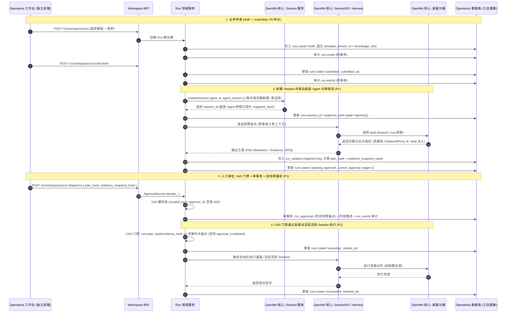

# Operations Workspace 架构设计 (v1.1)

> 状态：v1.1 · **评审定稿**（2026-08-17）
> 定位：本文是 Operations Workspace 的**组件集成架构章**，描述新增业务组件如何以**上层业务编排域（Domain Orchestration）**身份复用 OpenMA 底座核心组件。所有契约细节以下游 spec 为准，本文不另行定义。
> 修订记录：
> - v1.1（2026-08-17）：架构对抗性评审裁定落档——边界承诺新增第 4 条：**Run 状态推进仅由服务端领域服务（Session 终态回调）闭环驱动，SSE/StreamHub 仅为视图投影**（run-model v0.4.3 §9-3）；D1 迁移 `0002_operations_workspace` 回填 14 只 FK 镜像触发器（run-model §8-4 支配策略裁定：Cloudflare 文档与仓库适配层实证相悖，镜像两种 regime 下均正确）。
> - v1.0（2026-08-17）：依架构评审定稿。相对初版讨论稿的四处勘误：① 工作台 UI 为**独立前端**（非 Console 子页面，PRD §2）；② 申请链路补齐 `draft → submitted` 两步（P0 边界）；③ 审批端点对齐 BFF v0.4（`/runs/:id/approve|/reject`，无 `/approvals/:id/decide`）；④ StreamHub 能力边界对齐运行时事实（token 级 chunk 仅直播 best-effort、不可回放）。含裁定 E：Run↔Session 基数为**顺序多 Session、单活跃**（run-model v0.4.1）。
>
> 上游输入：
> - [operations-workspace-prd.md](file:///Users/bolin/Documents/git/openma/docs/operations-workspace-prd.md)（v0.5：§2 独立工作台定位、§5 P0 边界、§6 状态机）
> - [p0-run-data-model-spec.md](file:///Users/bolin/Documents/git/openma/docs/p0-run-data-model-spec.md)（v0.4.1：Run 聚合根、13 态 15 行迁移矩阵、Run↔Session 基数裁定）
> - [p0-operations-workspace-bff-api-spec.md](file:///Users/bolin/Documents/git/openma/docs/p0-operations-workspace-bff-api-spec.md)（v0.4：13 端点契约与 SSE 边界）
> - [p0-service-template-schema-spec.md](file:///Users/bolin/Documents/git/openma/docs/p0-service-template-schema-spec.md)（v0.4：模板版本与 Agent 绑定）
> - [p0-rbac-and-audit-catalog.md](file:///Users/bolin/Documents/git/openma/docs/p0-rbac-and-audit-catalog.md)（v0.4：RBAC 矩阵与审计字典）

---

## 1. 组件集成架构全景图

```mermaid
graph TB
    classDef existing fill:#1e293b,stroke:#475569,stroke-width:1px,color:#94a3b8;
    classDef newlyAdded fill:#0f3938,stroke:#10b981,stroke-width:2px,color:#ecfdf5;
    classDef storage fill:#1e1e38,stroke:#6366f1,stroke-width:1px,color:#e0e7ff;

    subgraph OpsUI ["独立工作台前端 (apps/operations — 新建独立部署)"]
        NewWorkspaceUI["Operations 工作台\n(Service Catalog / Run Tracker / Approval Center)\n复用 React/Radix/Tailwind/API Client/登录态 (PRD §2)"]:::newlyAdded
    end

    subgraph Console ["OpenMA 前端控制台 (apps/console — 平台管理面)"]
        OldConsole["现有控制台页面\n(Agents / Sessions / Vaults / Evals)\n+ 服务模板治理 (P0 后)"]:::existing
    end

    subgraph RouteLayer ["API 路由与 BFF 层 (packages/http-routes)"]
        CoreRoutes["OpenMA 核心路由\n(/v1/agents, /v1/sessions, /v1/vaults)"]:::existing
        WorkspaceRoutes["Workspace BFF 路由 (/v1/workspace/*)\n(13 端点: Templates / Runs / Approvals / SSE)"]:::newlyAdded
        AuthMiddleware["D0 租户鉴权与上下文中间件\n(TenantContext / SessionAuth)"]:::existing
    end

    subgraph DomainLayer ["业务领域编排层 (新增 Domain Services)"]
        RunEngine["Run 状态机驱动器\n(13 态 / 15 行迁移矩阵)"]:::newlyAdded
        CASGuard["双哈希 CAS 校验门禁\n(plan_hash + evidence_snapshot_hash)"]:::newlyAdded
        SoDVerifier["SoD 职责分离校验器\n(created_by != approver_id)"]:::newlyAdded
        D0Auditor["D0 统一审计记录器\n(run_events 写入, 单事务)"]:::newlyAdded
    end

    subgraph CoreRuntime ["OpenMA 核心执行引擎 (Core Agent Runtime — 零改造)"]
        SessionService["Session 管理服务\n(Snapshot 固化 / 状态管理)"]:::existing
        SessionDO["Cloudflare SessionDO / Node Harness\n(事件循环 / LLM 调用 / Tool Dispatcher)"]:::existing
        Sandbox["容器沙箱环境 (Cloud Sandbox)\n(执行 bash / read / write / edit 工具)"]:::existing
        OutboundProxy["Outbound Proxy 凭据注入\n(透明拦截沙箱请求，注入 Header)"]:::existing
    end

    subgraph StorageLayer ["存储层 (三店镜像 D1 / SQLite / PG)"]
        CoreTables[("OpenMA 核心表\nagents, agent_versions,\nsessions, vaults, credentials")]:::storage
        NewOpsTables[("新增 Operations 业务表\nservice_templates, service_template_versions,\nruns, run_approvals, run_artifacts, run_events")]:::newlyAdded
        VaultSecrets[("Vault 密钥密文库")]:::storage
    end

    %% 前端调用（两条独立入口）
    NewWorkspaceUI -->|REST / SSE| WorkspaceRoutes
    OldConsole -->|REST / SSE| CoreRoutes
    WorkspaceRoutes --> AuthMiddleware
    CoreRoutes --> AuthMiddleware

    %% BFF 到 领域层
    WorkspaceRoutes --> RunEngine
    WorkspaceRoutes --> CASGuard
    WorkspaceRoutes --> SoDVerifier
    WorkspaceRoutes --> D0Auditor

    %% 领域层调用 OpenMA 核心组件 (核心结合点)
    RunEngine -->|1. 每次规划期新建 Session (顺序多 Session, 单活跃)| SessionService
    RunEngine -->|2. 触发 Agent 规划/执行 (当前活跃 Session)| SessionDO
    WorkspaceRoutes -.->|3. SSE 代理: Run 状态事件 + Session 终态消息\n(token chunk 仅直播 best-effort, 不可回放)| SessionDO
    SessionDO -->|4. 在沙箱中执行运维工具| Sandbox
    Sandbox -->|5. 访问外部 K8s/云 API| OutboundProxy
    OutboundProxy -->|6. 获取并注入 Token| VaultSecrets

    %% 数据库读写
    SessionService --> CoreTables
    RunEngine --> NewOpsTables
    CASGuard --> NewOpsTables
    D0Auditor --> NewOpsTables
```

> **勘误 ①**：工作台是**独立前端**（独立建设、独立部署，暂定 `apps/operations`），不在 `apps/console` 内——PRD §2「平台管理配置留在 Console」。Console 只承接平台管理员视角的模板治理配置。

---

## 2. 新老组件协同的核心交互链（从申请到执行）



> **勘误 ②③**：初版讨论稿"创建即 `planning`、`/approvals/:id/decide`"两处与冻结契约不符——P0 边界止于 `submitted`（PRD §5），审批端点以 BFF v0.4 为准（`POST /runs/:id/approve` + `POST /runs/:id/reject`）。

---

## 3. 新增组件与核心组件的协作边界对比

| 架构维度 | OpenMA 现有核心底座 (Core Primitives) | 新增 Operations 业务组件 (Workspace Overlay) | 协同关系 |
|---|---|---|---|
| **聚合根** | `Session`（对话、推理与工具调用的会话生命周期） | `Run`（面向企业工单、审批流、SLA 的业务聚合根） | **1 Run : N Session（顺序、单活跃）**：每次进入 `planning`（首规划/返工/失效重提）新建 Session，历史 Session 保留审计留痕（run-model v0.4.1） |
| **版本管理** | `agents` / `agent_versions`（模型、提示词、工具集版本） | `service_template_versions`（表单 Schema、审批策略、超时规则） | **模板绑定 Agent**：模板版本固化底层 Agent 的 `agent_id` 与 `version`（K1） |
| **凭据安全** | `Vault` / `credentials` + Outbound Proxy（沙箱零明文注入） | 不自建凭据系统 | **直接复用**：Agent 在沙箱调外部 API 时，透明经由底座 Vault 注入凭据（vault 仅 outbound-agent 链路） |
| **事件体系** | `session.message`, `agent.tool_use`（细粒度事件；token chunk 帧为 broadcast-only 不落日志） | `run_events`（粗粒度 D0 三相位审计：`intent`, `result`, `reconciliation`） | **双层事件流**：StreamHub 聚合 Run 状态事件（可回放）与 Session 终态 `agent.message`（可回放）；token 级 chunk 仅对活跃订阅 best-effort 直播，**断线重连不可回放**（runtime 事实：canonical record 为最终 `agent.message`） |
| **权限控制** | API Key 鉴权 / Membership 租户归属 | RBAC 矩阵（`Applicant` / `Approver` / `PlatformAdmin`）+ SoD 硬门禁 | **业务增强**：在底座租户鉴权之上，叠加审批人与申请人互斥的 SoD 校验；跨租户/不存在一律 404 反探测 |

---

## 4. 核心优势与边界承诺

这种架构设计的核心优势在于 **"下层通用无感，上层强控合规"**：

1. 底座 Agent Runtime（Harness/SessionDO/Sandbox/Vault Proxy）**零侵入改造**，继续专注于高吞吐的工具调用与 LLM 思考；
2. 上层 Operations Workspace 专注处理企业级的工单流转、多级审批、CAS 方案防篡改和 D0 审计合规，实现架构解耦与复用；
3. 边界承诺同样明确：底座不感知 Run/审批语义；上层不得绕过底座直连沙箱或凭据（`TEST_NEG_BYPASS_BFF_DIRECT_SERVICE_INVOCATION`，RBAC §5）；SSE 不承诺 token 级回放（PRD §8 仅承诺 Run 状态事件 ≤2s）。
4. **状态推进的服务端闭环同样是硬边界**：Run 状态机只能由服务端领域服务驱动（监听 Session 回合终态、落库产物后以 CAS 原子流转），SSE/StreamHub 仅为视图投影——前端断开或浏览器关闭不得产生孤儿工单（run-model v0.4.3 §9-3）。
