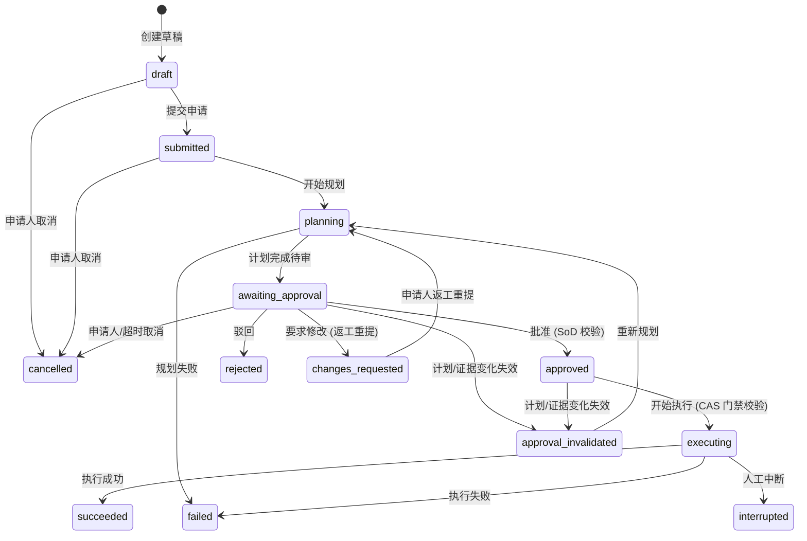

# Operations Workspace PRD

> 状态：v0.5 · **评审通过**（2026-08-17 第八轮复审：§6 `cancelled` 语义注释对齐裁决 5 与模板 timeout_policy——超时终局为"按策略系统取消或人工取消，均留审计留痕"；后续任何修订需重新评审）。v0.4 正名 `changes_requested`/`cancelled` 两态；v0.3 闭合快照归属与 P1 执行范围；v0.2 内嵌六问裁决。
> 上游文档：aiops-platform-reuse-and-roadmap.md（§3 P0/P1）
> 格式对齐：feishu-multi-agent-integration-prd.md

## 1. 背景与问题

数字员工能力已存在（agent 运行时、飞书渠道、HITL 原语），但**运营人员没有工作面**：

- 会诊/执行发生在 CLI 与飞书群，过程不可回看、不可度量；
- 审批散落在工具确认面板，无队列、无证据视图、无职责分离；
- 没有"服务"与"Run"的产品概念——能力无法以服务目录形式交付给运营团队；
- 现有 Console 面向平台管理员（治理配置），不是运营人员的工作台。

## 2. 产品定义

**Operations Workspace：面向运维/运营人员的独立工作台。** 以"服务"为单位申请 AI 运维能力，以"Run"为单位消费过程与结果，以审批为安全闸门。独立建设，复用 React/Radix/Tailwind/API Client/登录态/设计组件；平台管理配置留在 Console。

## 3. 目标用户与角色

| 人物 | 职责 | 备注 |
|---|---|---|
| 运营/SRE（申请人） | 浏览服务目录、提交申请、跟踪 Run、查看结果、人工干预/取消 | 主用户 |
| 审批人（变更经理/主管） | 处理审批待办、查看计划与证据、批准/驳回/要求修改 | 与申请人职责分离（SoD）；附条件批准为后续增强，不在 P1（见 §10 裁决 3） |
| 平台管理员 | 服务模板、权限、策略配置 | 留在 Console，不在本 PRD 范围；无业务 Run 直接审批特权 |
| 审计员（可选，P1 后） | 只读回看 Run 与审批留痕 | 角色模型见 D0 治理原则 |

## 4. 核心用户旅程（首发）

**旅程 1 · 申请**：浏览服务目录 → 选择服务模板 → 按模板表单填写（模板版本随申请固化）→ 提交创建 Run。

**旅程 2 · 审批**：审批人收到待办（Workspace 待办中心为主通道 + 飞书通知/深链，见 K5）→ 查看计划与证据快照（含知识引用溯源）→ 批准 / 驳回 / 要求修改。所批即所执行（plan_hash 绑定）。

**旅程 3 · 执行与跟踪**：Run 按工作流状态机执行 → 过程事件流（复用 SSE）→ 支持中断与人工干预。

**旅程 4 · 回看**：Run 详情页（申请表单、计划、证据、审批决策、执行过程、结果）→ 全程审计留痕 →（P3）MTTR/干预率度量。

## 5. 阶段范围（P0 ≠ 产品首发）

| 阶段 | 定位 | 内容 |
|---|---|---|
| **P0** | **平台底座 + 内部 Alpha**（不称产品首发） | BFF、Run 数据模型、服务模板（版本化；**服务模板与 Run resolved snapshot 由服务模板 schema / Run 模型 spec 定义**，本 PRD 定稿后解冻，不由版本快照 SDS 定义）、申请旅程；**Run 生命周期至多到 `submitted` / `cancelled`**，不做审批与执行 |
| **P1** | **可用 MVP（完整闭环）** | 审批服务（范围见 roadmap §4，附条件批准除外）、最小工作流状态机、执行与跟踪、回看、知识引用溯源、度量事件预埋（见 §10 裁决 6）。**P1 的"执行"仅限规划、只读诊断与工作流流转；外部系统受控变更的执行仍属 P2**（见 §11） |
| P2/P3 | 见 roadmap §3 | 告警闭环、策略门、扩面与度量看板 |

## 6. 用户可见 Run 状态机（P1 全态，P0 到 `submitted` / `cancelled`）

- 状态为**用户可见语义**，内部工作流步骤不暴露为本状态机的子状态；
- `approval_invalidated`：plan_hash/evidence_snapshot 变化后旧审批自动失效，Run 回到待重审或重新规划；
- `changes_requested`：审批人要求修改时进入该状态，申请人修改参数后返工重提（`changes_requested -> planning`）；
- `cancelled`：申请人在待审前/待审中主动放弃，或审批超时达到上限后按超时策略取消（系统自动或人工发起，均留审计留痕）；
- 超时策略**永不自动批准**（见 §10 裁决 5）；
- P1 的 `executing` 仅涵盖规划、只读诊断与工作流流转，不含外部系统受控变更（P2，见 §5/§11）。

## 7. 关键产品需求（PRD 级）

| # | 需求 | 用户感知 |
|---|---|---|
| K1 | 版本不可漂移：申请创建后，模板/Agent/工具/知识源的更新不影响该 Run | "我批的和跑的是同一个东西" |
| K2 | 所批即所执行：审批绑定 plan_hash/evidence_snapshot_hash，变化自动失效（`approval_invalidated`） | 审批 A 不会执行 B |
| K3 | 引用可溯源：诊断/规划结论标注知识来源 | 结论可查证 |
| K4 | 租户隔离：用户只见本租户的服务、Run、待办 | 跨租户不可见 |
| K5 | 审批通道分层（见下） | 待办必达、在哪批都一致 |

**K5 分层（对应裁决 4）**：

- **P1 基线**：Approval Service 为**唯一事实源**；Workspace 待办中心为主通道，完成全部审批操作；飞书侧先做**通知 + 深链跳转 Workspace**（复用 WS runner 推送）；WS 断连不影响服务端审批状态；
- **增强（P1 后按需）**：飞书卡片直接审批，但**必须走同一 Approval API**，不得旁路；上线前置条件：卡片操作者身份校验（=有权审批者）、签名校验、幂等键（重放/双击不双批）、双通道并发冲突测试；
- 飞书卡片审批不承诺为 P1 可用能力。

## 8. SLA / 非功能（建议值，待评审定标）

- 审批待办送达延迟：≤30s（复用 WS runner 推送）；
- Run 过程事件流延迟：≤2s（复用现有 SSE 通道）；
- 知识检索（含权限裁剪）P95：待定（Knowledge Service 接口冻结后压测定标）。

## 9. 验收标准（每条标注 P0/P1）

| # | 验收标准 | 阶段 |
|---|---|---|
| 1 | 运营人员从目录选模板到提交申请，全程不接触平台管理面；Run 稳定到达 `submitted` | **P0** |
| 2 | 审批人在 Workspace 完成一次"查看证据 → 批准"，Run 执行内容与所批 plan_hash / evidence_snapshot_hash 一致；计划变化后旧审批失效（`approval_invalidated`）；支持驳回与要求修改（`changes_requested`）返工 | **P1** |
| 3 | 运营人员实时看到 Run 状态流转（§6 状态机），可人工中断或取消（`cancelled` / `interrupted`） | **P1** |
| 4 | 任一 Run 可完整回看：表单、计划、证据、决策、过程、结果、审计记录 | **P1** |
| 5 | 度量事件预埋生效：申请、计划完成、待审、决策、执行开始、人工干预、完成/失败 + 各阶段时长可从事件还原 | **P1** |

## 10. 六问裁决记录（2026-08-17 评审定夺，已内嵌全文）

| # | 问题 | 裁决 |
|---|---|---|
| 1 | 审批人解析规则 | **版本化审批策略**（非模板绑定固定个人）。P1：固定审批组（支持按序分级） + 租户默认兜底审批组；动态路由后续再做；解析结果随 Run 固化 |
| 2 | 首发模板数量与种类 | **只上 2 个：只读故障诊断 + 受控变更规划**。不做资源开通类（依赖云执行器、回滚、配额、资产管理权限，条件均不成熟） |
| 3 | 附条件批准是否进首发 | **不进 P1**。P1 仅 批准/驳回/要求修改；后续仅支持结构化、机器可校验条件，自由文本条件不驱动执行 |
| 4 | 双通道优先级与降级 | Approval Service 唯一事实源；Workspace 主通道；飞书先通知/深链，卡片直批渐进；WS 断连不影响服务端审批；卡片不得旁路统一 API（→ K5 分层） |
| 5 | 审批超时升级策略 | 模板可覆盖、租户默认兜底；超时**通知**审批组与流程 Owner，可转交；**永不自动批准**；无人处理则 Run 按策略保持阻塞或取消（`cancelled`） |
| 6 | 度量埋点 | P1 预埋事件、P3 出看板。最少事件集：申请、计划完成、待审、审批决策、执行开始、人工干预、完成/失败 + 各阶段时长 |

## 11. 非目标

- 平台管理功能（留在 Console）；
- 附条件批准（后续增强，裁决 3）；
- 飞书卡片直接审批（K5 增强层，不承诺 P1）；
- 自动修复扩面与度量看板（P3）；
- CMDB/ITSM 界面（P2 只做连接器）；
- 多 agent 会诊编排产品化（独立工作流，见 roadmap §2.4）；
- 告警驱动的自动触发 Run（P2 闭环）；
- 外部系统受控变更的执行（P2 受控执行与领域回退，见 roadmap §3；P1 执行范围见 §5）；
- 资源开通类服务模板（裁决 2）。

## 12. 对下游 spec 的输出（本文档定稿后解冻）

- Run 模型 spec：Run 详情页字段需求（旅程 4）+ §6 状态机的持久化与迁移语义；
- 服务模板 schema：表单与版本化需求（旅程 1 + K1）+ 审批策略版本化（裁决 1）+ 超时策略模板级覆盖（裁决 5）；
- BFF API spec：旅程、页面清单与接口定义；
- RBAC 权限点：本文 §3 角色的粗粒度权限需求与 SoD 硬隔离；
- 审计事件目录：旅程 2/4 的事件骨架 + 度量事件集（裁决 6）。
