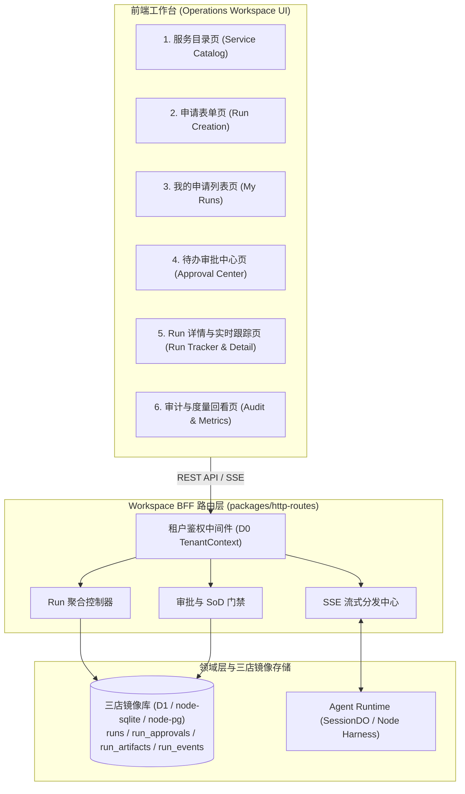
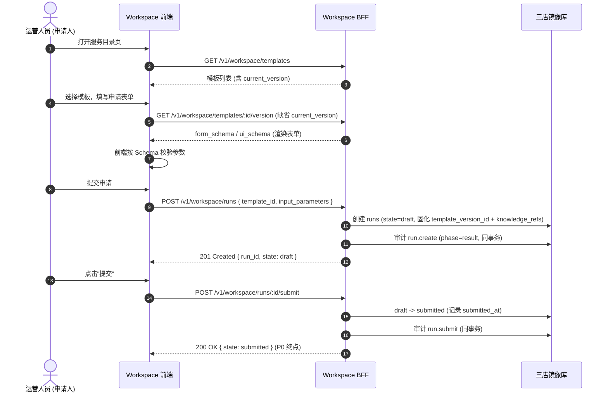
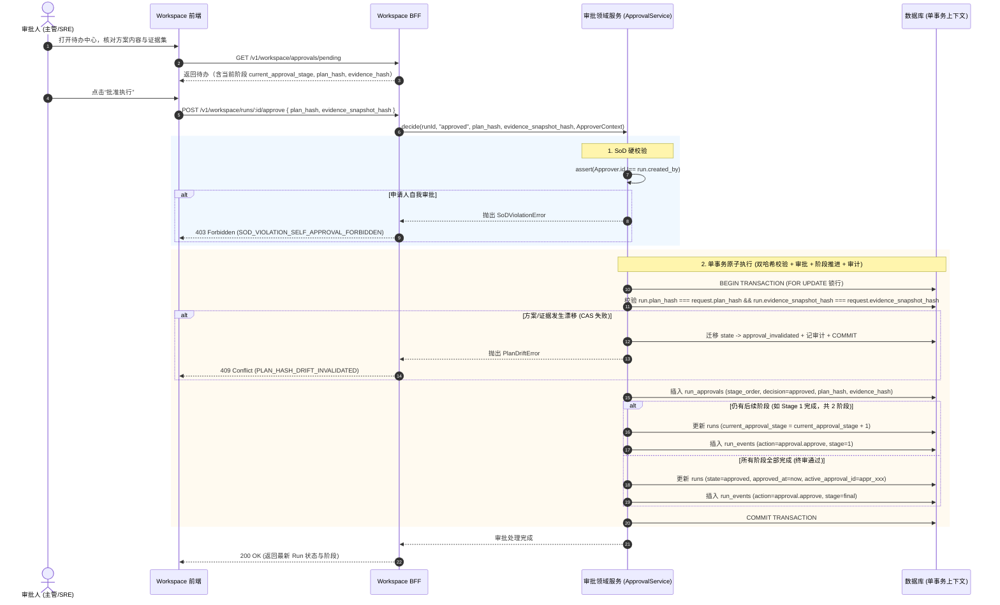

# Operations Workspace BFF API 规范与架构图 (v0.4)

> 状态：v0.4 · **评审定稿**（2026-08-17）
> 修订记录：
> - v0.4.8（2026-08-18）：F3 Phase 2 + P3-③ CF/D1 边缘架构对齐（§3.5 增补）——D1 Ticket 真源按请求解析（`c.var.tenantDb`）、`OperationsStreamRoom` DO 单点广播锚（`idFromName(tenant::run)`）、stream GET 豁免上游鉴权（Ticket 即权威，出票口仍全鉴权）、DO 发布以 `waitUntil` 锚定请求上下文；审批超时调度器抽取共享 tick 并注册 CF Cron（`OPERATIONS_TIMEOUT_CRON` 可配），跨 shard 扫描、旧 shard 软跳过。
> - v0.4.7（2026-08-18）：F3 Phase 1 跨副本契约增补（§3.5）——SSE Ticket 落库 `sse_tickets` 共享真源（DELETE RETURNING 原子单次消费）、PG LISTEN/NOTIFY 跨副本事件扇出（`oma_operations_events` 单通道 + origin-id 回声过滤）、通知层语义（无补帧）与超限帧本地降级；新增 `OPERATIONS_PG_SSE_HUB` 开关。
> - v0.4.6（2026-08-18）：新增 §3.6 审批超时调度器（Base E）——超时升级动作语义、`run.escalation` SSE 事件类型、系统取消审计与部署开关；不改变任何既有端点契约。
> - v0.4（2026-08-17）：闭合 Review R0——API 契约面自 7 个端点找回补全至 **13 个**：恢复服务目录接口（§3.1 #1/#2）、Run 查询与回看接口（§3.3 #7 列表 / #8 详情 / #9 历史事件，其中列表/详情自 v0.1 找回并升级 `current_approval_stage` 与双哈希字段）、审批待办全量定义（§3.4 #10，序列图引用自此有实体定义）；恢复旅程 1 序列图（§2.1）与 §3 鉴权总则；SSE Ticket 补限流与重放防护说明（R9 部分）。
> - v0.3（2026-08-17）：关闭 Review N5、N1、M8-半、LOW；审批请求体补齐 `evidence_snapshot_hash` 实现决策时点双哈希锚定（N5）；审批流程支持分级审批中间态流转（N1）；`POST /runs` 补充版本校验与缺省规则（M8-半）；补充 SSE 鉴权方案说明（短期 Ticket Token，LOW）。
> - v0.2（2026-08-17）：单事务原子审批时序、返工与取消接口、页面清单。
> - v0.1（2026-08-17）：初版草案。
>
> 上游输入：
> - [operations-workspace-prd.md](file:///Users/bolin/Documents/git/openma/docs/operations-workspace-prd.md)（v0.5：§4 核心旅程、§6 状态机、§7 K1-K5、§10 六问裁决）
> - [p0-run-data-model-spec.md](file:///Users/bolin/Documents/git/openma/docs/p0-run-data-model-spec.md)（v0.4：Run 聚合根、分级审批、状态迁移矩阵、CAS 门禁）
> - [p0-service-template-schema-spec.md](file:///Users/bolin/Documents/git/openma/docs/p0-service-template-schema-spec.md)（v0.4：分级审批策略与版本解析规则）
> - [p0-rbac-and-audit-catalog.md](file:///Users/bolin/Documents/git/openma/docs/p0-rbac-and-audit-catalog.md)（v0.4：权限点矩阵与审计动作字典）

---

## 1. 架构拓扑与页面清单



---

## 2. 核心旅程序列交互图

### 2.1 旅程 1 · 申请与版本固化 (P0 主链路，K1)



### 2.2 旅程 2 · 审批与 SoD 单事务门禁（含决策时点双哈希与分级流转）



---

## 3. REST API 契约定义

> **鉴权总则**：除 §3.5 SSE（Ticket 方案）外，所有接口经 `Authorization: Bearer <token>` 鉴权；BFF 统一注入可信 `TenantContext`（D0 §4：租户取自可信上下文，禁止客户端参数覆盖）。权限点映射见 RBAC 目录 §2。

### 3.1 服务目录与模板接口（页面 P1/P2）

#### 1. 获取服务模板列表
- **Endpoint**: `GET /v1/workspace/templates`
- **Permission**: `workspace.template:list`
- **Response** (200 OK):
```json
{
  "items": [
    {
      "id": "stpl_diag_01",
      "code": "readonly_fault_diagnosis",
      "name": "K8s 故障只读诊断",
      "category": "diagnostic",
      "is_active": true,
      "current_version": 3,
      "current_version_id": "stplv_03"
    }
  ]
}
```

#### 2. 获取模板版本详情（含表单 Schema）
- **Endpoint**: `GET /v1/workspace/templates/:id/version?version=<N>`
- **Permission**: `workspace.template:read`
- **版本解析规则 (对齐模板 spec §1.1)**：缺省（不带 `version`）返回模板主表 `current_version_id` 指向的当前版本；显式传递 `version=N` 返回对应历史版本（供回看存量 Run 固化版本使用）。
- **Response** (200 OK):
```json
{
  "template_id": "stpl_diag_01",
  "version_id": "stplv_03",
  "version": 3,
  "form_schema": { "...": "JSON Schema" },
  "ui_schema": { "...": "UI 渲染提示" }
}
```
- **Error Codes**: `404`: 模板不存在或不属于当前租户（反探测，不区分两者）。

### 3.2 Run 申请与生命周期接口（页面 P2/P3，对齐 M8-半）

#### 3. 创建 Run 草稿
- **Endpoint**: `POST /v1/workspace/runs`
- **Permission**: `workspace.run:create`
- **Request Body**:
```json
{
  "template_id": "stpl_diag_01",
  "template_version_id": "stplv_02", // 可选；缺省绑定当前 current_version_id
  "title": "支付网关 Pod 频繁 CrashLoopBackOff 排查",
  "input_parameters": {
    "cluster": "prod-k8s-us-east-1",
    "workload_name": "payment-gateway"
  }
}
```
- **服务端校验逻辑 (M8-半)**：
  - 若传递 `template_version_id`，服务端验证该版本属于 `template_id` 且 `is_active = true`；若不符合返回 `400 Bad Request (INACTIVE_OR_INVALID_TEMPLATE_VERSION)`。
  - `input_parameters` 必须通过该版本 `form_schema` 校验，失败返回 `400 Bad Request (FORM_SCHEMA_VALIDATION_FAILED)`。
- **Response** (201 Created): `{ "id": "run_01J8G5...", "state": "draft" }`

#### 4. 提交 Run 申请（P0 终点）
- **Endpoint**: `POST /v1/workspace/runs/:id/submit`
- **Response** (200 OK): `{ "id": "run_01J8G5...", "state": "submitted" }`

#### 5. 取消 Run 申请
- **Endpoint**: `POST /v1/workspace/runs/:id/cancel`
- **前置条件**: `state ∈ {draft, submitted, awaiting_approval}` 且操作者为申请人本人（矩阵行 3，run-model §5.2）。
- **Response** (200 OK): `{ "id": "run_01J8G5...", "state": "cancelled" }`

#### 6. 申请人返工重提 (对齐 PRD §6 / H2)
- **Endpoint**: `POST /v1/workspace/runs/:id/rework`
- **Request Body**: `{ "input_parameters": { ... } }`
- **服务端语义**: `changes_requested -> planning`（矩阵行 10）；`current_approval_stage` 重置为 1；`template_version_id` 与 `knowledge_refs` 保持不变；新产物以 `version+1` 追加（Append-Only）。
- **Response** (200 OK): `{ "id": "run_01J8G5...", "state": "planning" }`

### 3.3 Run 查询与回看接口（页面 P3/P5/P6，旅程 4）

#### 7. 我的 Run 列表
- **Endpoint**: `GET /v1/workspace/runs?state=<state>&limit=<N>&offset=<N>`
- **Permission**: `workspace.run:list_own`（申请人只见本人）；`workspace.run:list_all`（审批人/审计员见全租户）。
- **Response** (200 OK):
```json
{
  "total": 42,
  "items": [
    {
      "id": "run_01J8G5...",
      "title": "支付网关 Pod 频繁 CrashLoopBackOff 排查",
      "template_name": "K8s 故障只读诊断",
      "state": "awaiting_approval",
      "current_approval_stage": 2,
      "created_by": "user_0245",
      "plan_hash": "e3b0c442...",
      "created_at": 1755422400000
    }
  ]
}
```

#### 8. Run 详情（回看：表单 / 计划 / 证据 / 决策 / 时间戳）
- **Endpoint**: `GET /v1/workspace/runs/:id`
- **Permission**: `workspace.run:read_detail`（申请人限本人；审批人待审及已审；审计员全量）。
- **Response** (200 OK):
```json
{
  "id": "run_01J8G5...",
  "title": "支付网关 Pod 频繁 CrashLoopBackOff 排查",
  "state": "approved",
  "current_approval_stage": 2,
  "created_by": "user_0245",
  "service_template": { "id": "stpl_diag_01", "name": "K8s 故障只读诊断", "version_id": "stplv_03", "version": 3 },
  "input_parameters": { "cluster": "prod-k8s-us-east-1", "workload_name": "payment-gateway" },
  "knowledge_refs": [ { "kb_id": "kb_01", "version": "2026-08-10" } ],
  "plan": {
    "plan_hash": "e3b0c442...",
    "evidence_snapshot_id": "art_01J8G7...",
    "evidence_snapshot_hash": "a1b2c3d4...",
    "markdown_content": "## 诊断计划\n1. ..."
  },
  "knowledge_citations": [ { "artifact_id": "art_...", "source_kb": "kb_01", "quote": "..." } ],
  "approvals": [
    { "id": "appr_01", "stage_order": 1, "decision": "approved", "approver_id": "user_0301", "comment": "…", "created_at": 1755423000000 },
    { "id": "appr_02", "stage_order": 2, "decision": "approved", "approver_id": "user_0302", "comment": "…", "created_at": 1755423600000 }
  ],
  "timestamps": { "created_at": 1755422400000, "submitted_at": 1755422450000, "planned_at": 1755422800000, "approved_at": 1755423600000 }
}
```
- **Error Codes**: `404`: Run 不存在或非本租户（反探测）。

#### 9. Run 历史事件列表（旅程 4 审计回看）
- **Endpoint**: `GET /v1/workspace/runs/:id/events?limit=<N>&offset=<N>`
- **Permission**: `workspace.run:read_detail`。
- **Response** (200 OK):
```json
{
  "total": 12,
  "items": [
    {
      "id": "revt_01J8H1...",
      "action": "approval.approve",
      "phase": "result",
      "result": "success",
      "from_state": "awaiting_approval",
      "to_state": "approved",
      "payload": { "plan_hash": "e3b0c442...", "stage_order": 2 },
      "ts": 1755423600000
    }
  ]
}
```

### 3.4 审批中心接口（页面 P4，对齐 N5 双哈希）

#### 10. 待办审批列表
- **Endpoint**: `GET /v1/workspace/approvals/pending`
- **Permission**: `workspace.approval:list`。
- **Response** (200 OK):
```json
{
  "pending_count": 1,
  "items": [
    {
      "run_id": "run_01J8G5...",
      "title": "支付网关 Pod 频繁 CrashLoopBackOff 排查",
      "created_by": "user_0245",
      "current_approval_stage": 1,
      "submitted_at": 1755422450000,
      "planned_at": 1755422800000,
      "plan_hash": "e3b0c442...",
      "evidence_snapshot_hash": "a1b2c3d4...",
      "time_waiting_minutes": 37
    }
  ]
}
```
- **说明**: 列表范围 = 当前用户所在审批组（含租户默认兜底组）的待审 Run，且**过滤掉本人发起的 Run**（SoD 前置过滤，减少无效曝光）；`time_waiting_minutes` 服务 `awaiting_approval` 超时升级展示。

#### 11. 批准 Run 方案（双哈希决策时点绑定）
- **Endpoint**: `POST /v1/workspace/runs/:id/approve`
- **Request Body**:
```json
{
  "plan_hash": "e3b0c44298fc1c149afbf4c8996fb92427ae41e4649b934ca495991b7852b855",
  "evidence_snapshot_hash": "a1b2c3d4e5f6...", // N5 必填：决策时点证据哈希
  "comment": "已核对诊断方案与证据，同意执行"
}
```
- **Error Codes**:
  - `403`: `{ "code": "SOD_VIOLATION_SELF_APPROVAL_FORBIDDEN" }`（申请人自审批阻断，见 run-model §6.2）
  - `403`: `{ "code": "ADMIN_APPROVAL_BYPASS_FORBIDDEN" }`（平台管理员无业务审批特权，见 RBAC §1.1）
  - `409`: `{ "code": "PLAN_HASH_DRIFT_INVALIDATED" }`（方案内容哈希漂移）
  - `409`: `{ "code": "EVIDENCE_HASH_DRIFT_INVALIDATED" }`（证据快照哈希漂移）

#### 12. 要求修改 / 驳回
- **Endpoint**: `POST /v1/workspace/runs/:id/reject`
- **Request Body**:
```json
{
  "decision": "changes_requested", // 或 "rejected"
  "comment": "排查范围请限定在 payment-prod 命名空间"
}
```
- **服务端语义**: `changes_requested` → 矩阵行 9（申请人经 #6 `/rework` 返工）；`rejected` → 矩阵行 8（终态）。

### 3.5 实时流与 SSE 鉴权方案 (对齐 LOW)

#### 13. SSE 实时事件流
- **Endpoint**: `GET /v1/workspace/runs/:id/events/stream?token=<short_lived_ticket>`
- **鉴权方案说明 (LOW)**：
  - 针对原生浏览器 `EventSource` 无法携带自定义 `Authorization` Header 的问题，前端先调用 `POST /v1/workspace/auth/ticket` 换取有效期 30 秒的**一次性** Ticket，随后在 SSE URL 查询参数中携带 `?token=<ticket>`，BFF 网关校验 Ticket 后建立长连接；
  - **限流与重放防护 (R9 部分)**：Ticket 一次性消费（用后即焚）、30s TTL 过期作废、与签发用户+Run 绑定（不可跨 Run 复用）；端点 QPS 限流参数待压测定标（run-model §8 开放问题 3）。
  - **租户上下文裁定 (v0.4.5，Base D 评审 D2)**：非流式端点的租户上下文由 `x-tenant-id` 请求头派生（缺头且无上游注入即 401）；SSE 流端点因 `EventSource` 同样无法携带租户头，**以 Ticket 自身绑定的租户为权威**——存在显式租户上下文时 Ticket 必须与之匹配（失配 401），无上下文时按 Ticket 租户鉴权并以 `getRun(ticket租户, run_id)` 落 404 反探测。
  - **断线重连契约 (F6，待实现)**：Ticket 一次性消费意味着 `EventSource` 原生自动重连会以废票无限 401。Base D 前端已落地 `onerror → close()` 降级（断流显式提示、不自动重连）；正式契约应为**重连前重新出票**（客户端退避后重走 `POST /auth/ticket` 换新票再重建流），服务端语义不变。
  - **跨副本契约 (F3 Phase 1，v0.4.7)**：多副本部署下三重门的内存 Map 真源失效（副本 A 出票、副本 B 校验永 401）。裁定：
    - **Ticket 落库共享真源**：`POST /auth/ticket` 签发即写 `sse_tickets` 表（token 主键 / tenant / user / run 可空 / expires_at），消费即 `DELETE ... RETURNING` —— 数据库原子性保证跨副本单次消费（两副本竞抢恰好一个赢家），SQLite / D1 / PG 三方言同语义；`main-node` 两种方言统一注入 DB-backed store，SQLite 单进程模式行为与内存版逐位等价。过期清扫为机会主义（签发路径节流触发 + 仅回收未兑换票）。
    - **PG LISTEN/NOTIFY 事件扇出**：PG 模式下 OperationsStreamHub 换装 `PgOperationsStreamHub`——单通道 `oma_operations_events`，本地扇出先行、NOTIFY 跨副本广播，payload 携带发布方随机 origin-id 做**回声过滤**（PG 会把 NOTIFY 回声给发布者，本地已扇出过，必须丢弃）。经 H3 注入缝接线：service 与 BFF 必须共享同一 hub 实例。开关 `OPERATIONS_PG_SSE_HUB=0` 可熔断回退单进程内存扇出（默认开启）。
    - **通知层语义（无补帧）**：operations 流**不做** gap recovery（区别于会话流的 seq 水位线）——SSE 是通知层而非事实源，事实源是 DB + REST（`GET /runs/:id`）；LISTEN 掉线窗口丢帧即丢，F6 重连换票是恢复路径。
    - **超限帧本地降级**：PG NOTIFY payload 上限 8000 字节；超 7.5KB 的帧本地扇出 + warn、**不跨副本 NOTIFY**（其他副本缺该帧，同通知层语义）。
  - **CF/D1 边缘架构对齐 (F3 Phase 2 + P3-③，v0.4.8)**：Cloudflare Workers 形态下无 PG LISTEN/NOTIFY、无进程常驻调度器，裁定：
    - **D1 Ticket 真源（P2-①）**：`apps/main` 挂载点按请求解析 `c.var.tenantDb` 实例化 `DrizzleSseTicketStore`——D1 绑定随请求到达，挂载时刻不可得；消费即 `DELETE ... RETURNING`，与三方言同语义。
    - **DO 单点广播锚（P2-②）**：`OperationsStreamRoom` Durable Object 以 `idFromName(\`tenant::run\`)` 寻址——DO 单实例语义天然跨 isolate，副本 A 发布、副本 B 的订阅者同房可达。BFF 路由在 **Ticket 消费 + `getRun` 404 反探测之后**将整条 SSE 连接委托给 DO（鉴权先于委托）；DO 发 `event: connected` 首帧 + 15s `:heartbeat` 注释行心跳，帧格式与 main-node 逐字节同构（具名事件 + JSON data）。`hub.publish` 为 best-effort（失败不影响 DB 事务），但**必须以 `executionCtx.waitUntil` 锚定**——Workers 运行时在响应返回后可取消在途子请求，未锚定的 fire-and-forget 发布是间歇性丢帧源（H-1）。
    - **stream GET 豁免上游鉴权（H-2）**：`apps/main` 的 `/v1/*` authMiddleware 豁免 `GET /v1/workspace/runs/:id/events/stream`——EventSource 发不出 `x-api-key`，跨源 SPA 无 Console 会话 Cookie，上游强制鉴权会使合法 Ticket 永远 401。豁免后 **Ticket 即该端点唯一权威**（单次消费 + 30s TTL + 租户绑定 + 404 反探测仍在路由内）；`POST /auth/ticket` 出票口**保持全鉴权**。
    - **审批超时调度器 CF 注册（P3-③）**：scan-and-act 逻辑抽取为共享 `runOperationsTimeoutTick`（Node interval 与 CF Cron 跑同一份代码，仅点火机制不同；§3.6 语义不变、无自动批准不变量不变）。CF 侧经 shard 注册表跨租户扫描（`forEachShardServices`），**早于 operations 迁移（0003）的 shard 软跳过**、注册表不可读降级为记日志空转；cron 默认每分钟、`OPERATIONS_TIMEOUT_CRON` 可配；卡片出票用 bootstrap 层凭证（`OPERATIONS_FEISHU_APP_ID/SECRET`），缺凭证时卡片诚实降级 `delivered:false`、取消路径照跑——与 main-node 逐位同语义。CF Cron 每调度事件每 worker 至多发火一次，跨副本去重免费；重叠 tick 由 `run_events` 去重标记 + `cancelRun` CAS 兜底。

### 3.6 审批超时调度器（Base E，v0.4.6）

> 本节定义**系统侧后台组件**的行为契约，不新增 REST 端点。语义源头：run-model §6.3（裁决 5）与模板 spec §3.2（`timeout_policy`）。

- **调度循环**：main-node 进程内定时 tick（默认 60s，`OPERATIONS_TIMEOUT_INTERVAL_MS` 可配；`OPERATIONS_TIMEOUT_SCHEDULER=0` 关停），系统级扫描全部租户的 `awaiting_approval` Run（`listAwaitingApprovalRunsSystem`，仅调度器可用、永不经 BFF 暴露）。CF 形态经 Cron Triggers 点火**同一份共享 tick**（`OPERATIONS_TIMEOUT_CRON` 可配，见 §3.5 v0.4.8）。
- **超时锚点**：`runs.updated_at`——进入 `awaiting_approval` 与分级审批 stage 推进均会 CAS 刷新该字段，故**每个 stage 重新计时**。
- **动作词表**（模板版本 `timeout_policy.escalation_actions[]`，`at_minute` 达阈触发，`run_events` 以 `action=run.escalation` + `payload.dedup_key="<action>:<at_minute>"` 去重——每动作一次机会，发送失败也计已尝试，防通知风暴）：
  1. `notify_feishu_group`：向 `target`（chat_id）发送飞书互动卡片（`msg_type=interactive`，含工单要素与工作台深链）；
  2. `notify_process_owner`：P0 仅记审计不投递（无 user↔open_id 目录，债 F7）；
  3. `mark_approval_overdue_and_cancel`：系统 actor（`system_approval_timeout`）走**与人工取消完全相同的 CAS 路径**（矩阵行 3）迁移至 `cancelled`，`cancel_reason=approval_timeout`，留 `run.cancel` 审计并推送 `run.cancelled` SSE 帧；扫描与动作之间若人工已决策，CAS 冲突被吞——**人工永远赢**。
- **永不自动批准**：调度器不存在任何 approve 通道（系统级不变量，无配置开关）；未配置取消动作的 Run 超时后仅持续催办、保持 `awaiting_approval`。
- **SSE 事件**：词表新增 `run.escalation`（payload 含 `action` / `at_minute` / `dedup_key` / `delivered`），随既有 StreamHub 通道下发。
- **通知出站凭证**：`OPERATIONS_FEISHU_APP_ID` / `OPERATIONS_FEISHU_APP_SECRET`（bootstrap 档）显式配置；未配置时调度器照常取消与审计，卡片诚实降级 `delivered:false`（chat↔App 自动路由为债 E-N1）。
