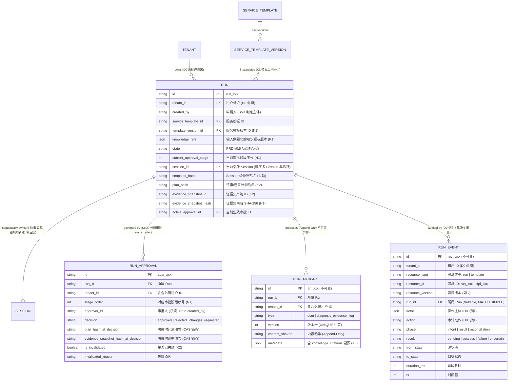
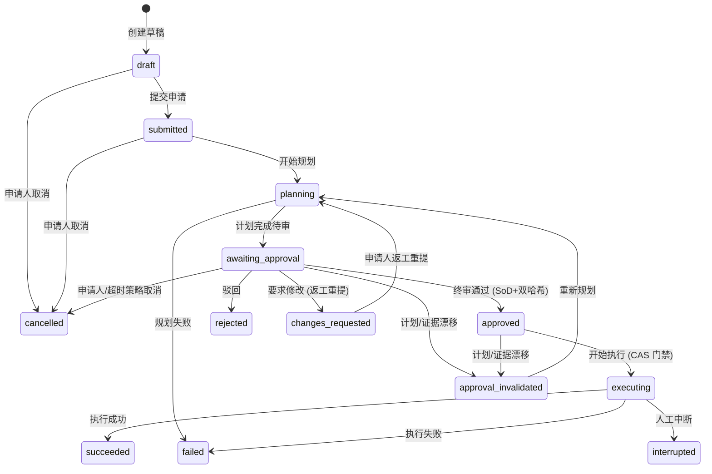

# Operations Run 数据模型 Spec (v0.4.4)

> 状态：v0.4.4 · **评审定稿**（2026-08-17）
> 修订记录：
> - v0.4.4（2026-08-17）：Base C 验收落档——§8 行 3 拆分为 **R9a / R9b 诚实记账**：R9a（一次性消费 + 30s TTL + 租户/Run 双向绑定 + 重放/跨租户反探测）随 Base C 收口，票据仓新增 TTL 节流清扫与 FIFO 容量上限（10k）防无界增长；R9b（QPS 限流窗口 + UA 指纹绑定的压测定标）**未实现、保持开放**（代码零限流逻辑，评审 F1 裁定不许改题关门）。
> - v0.4.3（2026-08-17）：架构对抗性评审落地——新增 **§9「Base B 实现不变量」**（状态 CAS / 审批审计单事务 / Session 终态服务端闭环）；§8 新增开放项 5（`run_artifacts` 大对象 offload 定标）；**D1 触发器策略修订**：Cloudflare 官方文档称 D1 默认强制外键，但仓库 sql-client 适配层留有相反运行时实证（`packages/sql-client/src/adapters/better-sqlite3.ts:150-154`，children-first 安装流成功）——事实无法当场复演，按"两种 regime 下都正确"的支配策略，D1 迁移 `0002_operations_workspace` **同步回填同款 14 只 `trg_fk*` 镜像**（FK=ON 时冗余、FK=OFF 时承重），并以独立测试套件固化（D1 文件 standalone FK=OFF 全量准则）。
> - v0.4.2（2026-08-17）：实现期勘误（Base A）——`run_events` 复合外键删除动作由 `ON DELETE SET NULL` 改为 **`NO ACTION`**：复合外键的 SET NULL 会将整组引用列（含 `NOT NULL tenant_id`）置空，任何 Run 物理删除将直接违约报错；且 P0 无 Run 删除流程，审计子表引用即阻止删除（对齐 feishu-ops 0002 `trg_fkd` 的 RAISE ABORT 先例，三店语义一致）。`run_id` 可空性与 MATCH SIMPLE 校验规则不变。
> - v0.4.1（2026-08-17）：架构评审裁定 **Run↔Session 基数**——一个 Run 生命周期内**顺序持有多个 Session**（每次进入 `planning` 新建一个，含首次规划与返工/失效重规划），**任一时刻至多一个活跃**：ER 基数改 `RUN ||--o{ SESSION`；`runs.session_id` 释义收窄为"当前活跃 Session"；§5.2 行 12 明确失效重规划**新建 Session**（历史 Session 保留完整审计留痕）。对齐运行时约束"Session 同一时刻仅一个活跃 turn"。
> - v0.4（2026-08-17）：闭合 Review R1/R2/R6/R7——恢复 §5.2 状态迁移完整矩阵（自 v0.2 找回，合并分级审批阶段重置、返工保持 knowledge_refs、失效传播至本轮全部阶段审批记录）；恢复 §6 D0 治理穿透三节（租户反探测 404 / SoD 断言公式与错误码归属 / 超时永不自动批准）；CAS 示例 `resource_version` 与同事务 `updated_at` 对齐（R6）；新增 §8 开放问题清单（R5/R8/R9 与迁移 Trigger 复核）。
> - v0.3（2026-08-17）：关闭 Review N1-N9、M8-半、M10-缺、LOW 项；`runs` 与 `run_approvals` 增加 `current_approval_stage` / `stage_order` 闭合分级审批中间态（N1）；`run_events` 显式声明 MATCH SIMPLE 与 Trigger 镜像规则（N4）；清理 `approval_policy_id` / `policy_version` 悬空字段（N6）；规范 `run` 资源 `resource_version` 定义（N7）；`run_artifacts` 增加复合唯一约束（N8）；度量公式注明 `decision_at = run_approvals.created_at`（N9）；修复 ER 图 Session 基数。
> - v0.2（2026-08-17）：关闭 H1-H7，不可变产物、双哈希 CAS、三店镜像、返工与取消链路。
> - v0.1（2026-08-17）：初版草案。
>
> 上游输入：
> - [operations-workspace-prd.md](file:///Users/bolin/Documents/git/openma/docs/operations-workspace-prd.md)（v0.5：§6 状态机、§7 关键需求 K1-K5、§10 六问裁决）
> - [p0-version-snapshot-sds.md](file:///Users/bolin/Documents/git/openma/docs/p0-version-snapshot-sds.md)（v0.7：Session agent 快照事实源、`snapshot_hash` / `config_hash`、CAS 冻结态）
> - [p0-governance-principles.md](file:///Users/bolin/Documents/git/openma/docs/p0-governance-principles.md)（v0.3：D0 租户所有权五原则、SoD 职责分离、统一审计信封）

---

## 1. 范围与阶段分界

```
┌─────────────────────────────────────────────────────────────────────────────┐
│ P0 范围（平台底座 + 内部 Alpha）                                            │
│ • runs 聚合根创建、读取、租户硬隔离（三店镜像：D1 / node-sqlite / node-pg） │
│ • 服务模板版本固化（template_version_id）与输入知识源（knowledge_refs）     │
│ • 绑定底层 Agent 会话与快照事实源（session_id + snapshot_hash）             │
│ • 生命周期严格收敛在：draft ──> submitted / cancelled                       │
│ • 控制面单段审计留痕（D0 phase=result）                                     │
└─────────────────────────────────────────────────────────────────────────────┘
                                       │
                                       ▼ 解冻流转（P1 闭环）
┌─────────────────────────────────────────────────────────────────────────────┐
│ P1 范围（可用 MVP 完整闭环）                                                │
│ • 状态机全态流转（对齐 PRD v0.5 §6）：planning ─> awaiting_approval ─>      │
│   approved / rejected / changes_requested ─> executing ─>                  │
│   succeeded / failed / interrupted / cancelled                              │
│ • 分级审批中间态流转（current_approval_stage / stage_order）                 │
│ • 不可变产物表（run_artifacts）与证据内容哈希（evidence_snapshot_hash）      │
│ • 审批实体 run_approvals 与 SoD 强校验（created_by !== approver_id）        │
│ • plan_hash 与 evidence_snapshot_hash 双重 CAS 失效门禁                     │
│ • 知识库引用溯源元数据（knowledge_citations）                               │
│ • 裁决 6 阶段度量埋点预埋（7 项核心事件与完整时延计算）                      │
└─────────────────────────────────────────────────────────────────────────────┘
```

---

## 2. 存储落位与仓库 Schema 惯例 (对齐 H6 / N4)

数据表严格按仓库三店镜像规范实现，并通过复合外键与手写 Trigger 确保租户一致性：

1. **落位目录**：
   - `packages/db-schema/src/cf-auth/operations.ts`（D1：`apps/main/migrations/`）
   - `packages/db-schema/src/node-sqlite/operations.ts`（SQLite：`apps/main-node/migrations-sqlite/`）
   - `packages/db-schema/src/node-pg/operations.ts`（PG：`apps/main-node/migrations/`）
2. **复合外键与 MATCH SIMPLE 规则 (N4)**：
   - `run_approvals` 与 `run_artifacts`：`FOREIGN KEY (tenant_id, run_id) REFERENCES runs(tenant_id, id) ON DELETE CASCADE`；
   - `run_events`（审计信封）：`FOREIGN KEY (tenant_id, run_id) REFERENCES runs(tenant_id, id) ON DELETE NO ACTION`（v0.4.2 勘误：复合 FK 的 SET NULL 会连坐置空 `NOT NULL tenant_id`；审计引用阻止 Run 物理删除，对齐 feishu-ops 0002 先例）；遵循 **MATCH SIMPLE** 规则 —— 当 `run_id IS NULL`（如模板发布 `template.publish` 等全局/租户级事件）时跳过外键校验；当 `run_id` 非空时，PG 原生校验，SQLite 下由迁移文件中的手写 Trigger 镜像执行存在性校验；
   - `resource_type` 与 `resource_id` 构成应用层多态引用（`run` $\to$ `run_xxx`，`template` $\to$ `stpl_xxx`）。

---

## 3. 实体全景与关系模型



---

## 4. Schema 详细设计

### 4.1 `runs` 聚合根表

| 字段 | 类型 | 必填 | 约束 / 索引 | 说明 |
|---|---|---|---|---|
| `id` | `VARCHAR(64)` | 是 | PK | 前缀 `run_` |
| `tenant_id` | `VARCHAR(64)` | 是 | INDEX | 租户隔离标识（D0 §4） |
| `title` | `VARCHAR(256)` | 是 | | 申请标题 |
| `created_by` | `VARCHAR(64)` | 是 | INDEX | 申请人 User ID（SoD 判定基准） |
| `service_template_id` | `VARCHAR(64)` | 是 | INDEX | 关联服务模板 |
| `template_version_id` | `VARCHAR(64)` | 是 | | 固化的服务模板版本（K1） |
| `knowledge_refs` | `TEXT` (JSON) | 否 | | K1 输入侧固化的知识源清单与版本快照 |
| `input_parameters` | `TEXT` (JSON) | 是 | | 申请表单实参（符合模板 Schema） |
| `state` | `VARCHAR(32)` | 是 | INDEX | PRD v0.5 状态机当前状态 |
| `current_approval_stage` | `INT` | 是 | DEFAULT 1 | **当前审批阶段序号**（N1 分级审批中间态） |
| `session_id` | `VARCHAR(64)` | 否 | INDEX | **当前活跃** Session ID（Run 生命周期内顺序多个、任一时刻至多一个活跃，v0.4.1） |
| `snapshot_hash` | `VARCHAR(64)` | 否 | | 当前活跃 Session 的快照哈希（B 轨，随新建 Session 刷新） |
| `plan_hash` | `VARCHAR(64)` | 否 | | 当前计划内容 SHA-256（K2 判定点） |
| `evidence_snapshot_id`| `VARCHAR(64)` | 否 | | 当前诊断证据快照产物 ID |
| `evidence_snapshot_hash`| `VARCHAR(64)` | 否 | | 当前诊断证据内容 SHA-256（H1 判定点） |
| `active_approval_id` | `VARCHAR(64)` | 否 | | 当前生效的审批记录 ID |
| `failure_reason` | `TEXT` (JSON) | 否 | | 失败/中断/取消原因 |
| `created_at` | `BIGINT` | 是 | INDEX | 创建时间戳（ms） |
| `updated_at` | `BIGINT` | 是 | | 最后更新时间戳（ms） |
| `submitted_at` | `BIGINT` | 否 | | 提交时间戳（`submitted` 触发时记录） |
| `planned_at` | `BIGINT` | 否 | | 规划完成时间戳（`awaiting_approval` 时记录） |
| `approved_at` | `BIGINT` | 否 | | 终审通过时间戳（进入 `approved` 时记录） |
| `started_at` | `BIGINT` | 否 | | 执行开始时间戳（`executing` 时记录） |
| `finished_at` | `BIGINT` | 否 | | 终态到达时间戳（`succeeded`/`failed`/`interrupted`/`cancelled`） |

**复合约束与索引**：
- `UNIQUE (tenant_id, id)` —— 作为子表复合外键的目标
- `INDEX idx_runs_tenant_state` (`tenant_id`, `state`, `created_at` DESC)
- `INDEX idx_runs_tenant_creator` (`tenant_id`, `created_by`, `created_at` DESC)

---

### 4.2 `run_approvals` 审批决策表

| 字段 | 类型 | 必填 | 约束 / 索引 | 说明 |
|---|---|---|---|---|
| `id` | `VARCHAR(64)` | 是 | PK | 前缀 `appr_` |
| `run_id` | `VARCHAR(64)` | 是 | INDEX | 所属 Run ID |
| `tenant_id` | `VARCHAR(64)` | 是 | INDEX | 复合外键租户 ID |
| `stage_order` | `INT` | 是 | | **对应审批阶段序号**（N1，如 1=SRE初审, 2=业务复核） |
| `approver_id` | `VARCHAR(64)` | 是 | INDEX | 审批人 User ID（必须 `!= run.created_by`） |
| `decision` | `VARCHAR(32)` | 是 | | `approved` \| `rejected` \| `changes_requested` |
| `comment` | `TEXT` | 否 | | 审批人填写的审核意见 |
| `plan_hash_at_decision`| `VARCHAR(64)` | 是 | | 决策时的 `plan_hash`（CAS 锚点） |
| `evidence_snapshot_hash_at_decision`| `VARCHAR(64)`| 是 | | 决策时的 `evidence_snapshot_hash`（CAS 锚点） |
| `is_invalidated` | `BOOLEAN` / `INT` | 是 | DEFAULT 0 | 是否因计划/证据漂移而失效（K2） |
| `invalidated_reason` | `VARCHAR(128)` | 否 | | 失效原因（`PLAN_HASH_DRIFT` / `EVIDENCE_HASH_DRIFT`） |
| `invalidated_at` | `BIGINT` | 否 | | 失效时间戳（ms） |
| `created_at` | `BIGINT` | 是 | INDEX | 审批决策时间戳（ms） |

**外键约束**：
- `FOREIGN KEY (tenant_id, run_id) REFERENCES runs(tenant_id, id) ON DELETE CASCADE`

---

### 4.3 `run_artifacts` 产物与证据表 (Append-Only 不可变)

| 字段 | 类型 | 必填 | 约束 / 索引 | 说明 |
|---|---|---|---|---|
| `id` | `VARCHAR(64)` | 是 | PK | 前缀 `art_`（单次生成唯一） |
| `run_id` | `VARCHAR(64)` | 是 | INDEX | 所属 Run ID |
| `tenant_id` | `VARCHAR(64)` | 是 | INDEX | 复合外键租户 ID |
| `type` | `VARCHAR(32)` | 是 | | `plan` \| `diagnosis_evidence` \| `execution_log` |
| `version` | `INT` | 是 | DEFAULT 1 | 产物迭代版本号 |
| `content` | `LONGTEXT` / `TEXT` | 是 | | 产物文本/Markdown/JSON 内容（不可变） |
| `content_sha256` | `VARCHAR(64)` | 是 | INDEX | 内容 SHA-256（作为 `plan_hash` / `evidence_snapshot_hash`） |
| `metadata` | `TEXT` (JSON) | 否 | | 结构化元数据（含 K3 知识引用溯源） |
| `created_by` | `VARCHAR(64)` | 是 | | 生成者（Agent ID / User ID / System） |
| `created_at` | `BIGINT` | 是 | | 创建时间戳（ms） |

**外键与唯一约束 (N8)**：
- `FOREIGN KEY (tenant_id, run_id) REFERENCES runs(tenant_id, id) ON DELETE CASCADE`
- `UNIQUE (tenant_id, run_id, type, version)` —— 保证同类型产物版本号单调递增且不重复

---

### 4.4 `run_events` 审计与度量事件表 (对齐 D0 必填信封与 N4/N7)

| 字段 | 类型 | 必填 | 约束 / 索引 | 说明 |
|---|---|---|---|---|
| `id` | `VARCHAR(64)` | 是 | PK | 前缀 `revt_`（不可变） |
| `tenant_id` | `VARCHAR(64)` | 是 | INDEX | 租户 ID（D0 必填） |
| `resource_type` | `VARCHAR(32)` | 是 | | 资源类型：`run` \| `template` \| `approval` |
| `resource_id` | `VARCHAR(64)` | 是 | INDEX | 资源 ID：`run_xxx` \| `stpl_xxx` |
| `resource_version` | `VARCHAR(32)` | 否 | | **资源版本定义 (N7)**：Run 资源为 `v<updated_at>`，模板为 `stplv_xxx` |
| `run_id` | `VARCHAR(64)` | 否 | INDEX | 所属 Run ID（**Nullable, MATCH SIMPLE**，N4） |
| `actor` | `TEXT` (JSON) | 是 | | 操作主体 `{ type: "user"|"agent"|"system", id: string, name?: string }` |
| `action` | `VARCHAR(64)` | 是 | INDEX | 审计动作字典 |
| `phase` | `VARCHAR(16)` | 是 | | D0 审计相位：`intent` \| `result` \| `reconciliation` |
| `result` | `VARCHAR(16)` | 是 | | `pending` \| `success` \| `failure` \| `uncertain` |
| `from_state` | `VARCHAR(32)` | 否 | | 状态流转起始状态 |
| `to_state` | `VARCHAR(32)` | 否 | | 状态流转目标状态 |
| `payload` | `TEXT` (JSON) | 否 | | 决策必须含 `plan_hash` 与 `evidence_snapshot_hash` |
| `duration_ms` | `INT` | 否 | | 阶段耗时（ms） |
| `trace_id` | `VARCHAR(64)` | 是 | INDEX | 全局链路 Trace ID |
| `ts` | `BIGINT` | 是 | INDEX | 事件发生时间戳（ms） |

---

## 5. 状态机生命周期与迁移规则 (对齐 N1 / PRD v0.5)

### 5.1 分级审批流转规则 (N1)

当服务模板配置了多阶段分级审批（如 `stages: [SRE初审, 业务复核]`）：
1. **阶段 1 审批通过**：
   - 插入 `run_approvals` 记录（`stage_order=1`, `decision=approved`）；
   - `runs.current_approval_stage` 递增为 2；
   - `runs.state` **保持在 `awaiting_approval`**，向阶段 2 审批组发送待办通知；
2. **阶段 2（终审）审批通过**：
   - 插入 `run_approvals` 记录（`stage_order=2`, `decision=approved`）；
   - `runs.state` 流转为 **`approved`**，记录 `approved_at` 与 `active_approval_id`；
3. **任意阶段驳回或要求修改**：
   - 立即流转至 `rejected`（终止）或 `changes_requested`（返工）。
4. **失效传播 (R7)**：
   - 一旦进入 `approval_invalidated`，**本轮全部阶段**的 `run_approvals` 记录（含已通过的 stage 记录）一律标记 `is_invalidated=true`，并清空 `runs.active_approval_id` —— 不留任何"部分有效"的孤儿审批记录。

### 5.2 状态迁移完整矩阵 (恢复自 v0.2，合并分级审批 / 返工 / 取消语义)



| # | 源状态 | 目标状态 | 触发者 | 前置条件 | 副作用与审计（同事务） |
|---|---|---|---|---|---|
| 1 | `[*]` | `draft` | 申请人 | 模板与版本有效（版本解析规则见模板 spec §1.1）；`input_parameters` 通过 `form_schema` 校验 | 写 `runs`；`run.create`（phase=result） |
| 2 | `draft` | `submitted` | 申请人 | 表单必填完整 | 固化 `template_version_id` 与 `knowledge_refs`；记录 `submitted_at`；`run.submit` |
| 3 | `draft` / `submitted` / `awaiting_approval` | `cancelled` | 申请人 或 超时策略（系统） | 申请人=本人；或触发 `timeout_policy` 终局（模板 spec §3.2） | 记录 `finished_at` 与 `failure_reason.cancel_reason`；`run.cancel`（payload 含原因） |
| 4 | `submitted` | `planning` | 系统 | **新建 Session** 成功（v0.4.1：每次进入 `planning` 均新建） | 固化 `session_id` 与 `snapshot_hash`；`run.plan_start`（外部副作用两段 intent→result） |
| 5 | `planning` | `awaiting_approval` | Agent | 插入不可变产物（plan + evidence 各自 `content_sha256`） | 写 `plan_hash` / `evidence_snapshot_id` / `evidence_snapshot_hash` / `planned_at`；`current_approval_stage` 置 1；`run.await_approval` |
| 6 | `planning` | `failed` | 系统 | 规划异常捕获 | `finished_at` + `failure_reason`；`run.plan_finish`（result=failure） |
| 7 | `awaiting_approval` | `approved` | 终审审批人 | SoD 硬校验（§6.2）；**全部前序阶段已通过**（§5.1 规则 2） | 单事务：插入终审 `run_approvals` + state + `approved_at` + `active_approval_id` + `approval.approve`（H7） |
| 8 | `awaiting_approval` | `rejected` | 审批人 | SoD 硬校验；驳回理由必填 | 单事务：`run_approvals(decision=rejected)` + state + `finished_at` + `approval.reject` |
| 9 | `awaiting_approval` | `changes_requested` | 审批人 | SoD 硬校验；修改意见必填 | 单事务：`run_approvals(decision=changes_requested)` + state + `approval.request_changes`（payload 含 `rework_comments`） |
| 10 | `changes_requested` | `planning` | 申请人 | 申请人本人；修改后参数通过 `form_schema` 校验 | **`current_approval_stage` 重置为 1**；`template_version_id` 与 `knowledge_refs` **保持不变**（模板版本未变，K1 快照不动）；新产物以 `version+1` 追加（Append-Only） |
| 11 | `awaiting_approval` / `approved` | `approval_invalidated` | 系统（漂移检测） | `plan_hash` 或 `evidence_snapshot_hash` 任一与决策时点不一致 | **本轮全部阶段审批记录 `is_invalidated=true`**（§5.1 规则 4，R7）；清空 `active_approval_id`；`approval.invalidate`（payload 含新旧双哈希） |
| 12 | `approval_invalidated` | `planning` | 申请人（重提） | 申请人本人发起重新规划 | **新建 Session**（顺序多 Session、单活跃，v0.4.1；历史 Session 保留审计留痕）；余复用行 4/5 语义：新产物版本追加、`current_approval_stage` 重置 1 |
| 13 | `approved` | `executing` | 系统 | **CAS 门禁**（§5.3 双哈希校验通过） | 记录 `started_at`；`run.exec_start`（外部副作用两段 intent→result） |
| 14 | `executing` | `succeeded` / `failed` | 系统 | 执行终态 | `finished_at`（+`failure_reason`）；`run.exec_finish` |
| 15 | `executing` | `interrupted` | 申请人/管理员 | 干预指令下发 | 中断信号发 Session；`finished_at` + `failure_reason`；`run.interrupt` |

> 矩阵为**穷举闭合**：除上表 15 行外不存在任何合法迁移；所有迁移在单数据库事务内完成状态写入 + 时间戳 + 审计事件（H7），跨事务迁移一律非法。

### 5.3 K2 "所批即所执行" CAS 门禁校验算法

```typescript
// 执行门禁原子校验逻辑 (CAS Gate)
async function verifyExecutionGate(runId: string, tenantId: string, tx: Transaction): Promise<void> {
  const run = await tx.runs.findByIdForUpdate(runId, tenantId);
  
  if (run.state !== 'approved') {
    throw new InvalidStateTransitionError(`Run is in state ${run.state}, expected approved`);
  }
  
  if (!run.active_approval_id) {
    throw new InvariantViolationError(`Run has state 'approved' but active_approval_id is null`);
  }
  
  const approval = await tx.runApprovals.findById(run.active_approval_id, tenantId);
  
  // 1. 审批失效检查
  if (approval.is_invalidated) {
    await transitionToInvalidated(run, 'APPROVAL_ALREADY_INVALIDATED', tx);
    throw new ApprovalInvalidatedError(`Approval ${approval.id} is marked as invalidated`);
  }
  
  // 2. 双重哈希一致性校验
  const isPlanConsistent = run.plan_hash === approval.plan_hash_at_decision;
  const isEvidenceConsistent = run.evidence_snapshot_hash === approval.evidence_snapshot_hash_at_decision;
  
  if (!isPlanConsistent || !isEvidenceConsistent) {
    const driftReason = !isPlanConsistent ? 'PLAN_HASH_DRIFT' : 'EVIDENCE_HASH_DRIFT';
    const now = Date.now();
    
    // R7 失效传播：本轮全部阶段审批记录一并失效，不留"部分有效"孤儿记录
    await tx.runApprovals.markRoundInvalidated(run.id, tenantId, { reason: driftReason, invalidated_at: now });
    await tx.runs.updateState(run.id, {
      state: 'approval_invalidated',
      active_approval_id: null,
      updated_at: now
    });
    
    await tx.runEvents.insert({
      tenant_id: tenantId,
      resource_type: 'run',
      resource_id: run.id,
      resource_version: `v${now}`, // R6/N7：与本次 updateState 写入的 runs.updated_at 对齐
      run_id: run.id,
      actor: { type: 'system', id: 'execution_gate' },
      action: 'approval.invalidate',
      phase: 'result',
      result: 'success',
      from_state: 'approved',
      to_state: 'approval_invalidated',
      payload: {
        reason: driftReason,
        run_plan_hash: run.plan_hash,
        approved_plan_hash: approval.plan_hash_at_decision,
        run_evidence_hash: run.evidence_snapshot_hash,
        approved_evidence_hash: approval.evidence_snapshot_hash_at_decision
      },
      trace_id: tx.traceId,
      ts: now
    });
    
    throw new ApprovalInvalidatedError(`Plan or evidence changed since approval (${driftReason}). Execution blocked.`);
  }
}
```

---

## 6. D0 治理原则穿透 (恢复自 v0.2，语义对齐 PRD v0.5 / RBAC v0.4)

### 6.1 租户所有权与反探测（D0 §4）

- 四张表（`runs` / `run_approvals` / `run_artifacts` / `run_events`）一律以 `tenant_id` 为复合索引第一列，所有查询必须走租户前缀，禁止跨租户 JOIN；
- 对"不存在"与"非本租户"的资源访问**统一返回 `404 Not Found`**（反探测，不泄露资源存在性），错误响应不区分两者；
- 复合外键 `(tenant_id, run_id)` 从结构上杜绝"租户 A 的审批挂在租户 B 的 Run 上"的错挂。

### 6.2 SoD 职责分离硬约束（D0 §3）

- 断言公式：`assert(run.created_by !== currentUser.id)`，违反即 `403 Forbidden (SOD_VIOLATION_SELF_APPROVAL_FORBIDDEN)`（错误码唯一定义点：BFF spec §3.4 / RBAC 目录 §5，本文档不重复定义）；
- **分级审批的每一阶段独立执行 SoD 校验**——同一审批人在不同阶段出现也必须每次断言；
- 平台管理员**无业务 Run 直接审批特权**（PRD §3 / RBAC §1.1）：若管理员在审批组内，必须以 `role_approver` 身份行动，且同样受 SoD 约束。

### 6.3 审批超时与"永不自动批准"（裁决 5）

- 超时调度器**仅支持三类动作**：① 催办通知（飞书组/审批人）；② 转交（转交对象仍受 SoD 约束）；③ 按策略取消（系统动作迁移至 `cancelled`，留 `run.cancel` 审计，`cancel_reason=approval_timeout`，见模板 spec §3.2 与 PRD v0.5 §6）；
- **绝无自动批准通道**——这是系统级不变量，不提供任何配置项开关；
- 超时终局从 `awaiting_approval` 走矩阵行 3（取消），而非任何形式的"默认通过"。

---

## 7. 裁决 6 阶段度量埋点预埋 (对齐 N9)

| 指标代码 | 指标名称 | 计算公式 / 来源 | 业务意义 |
|---|---|---|---|
| `METRIC_APPLY_TO_PLAN` | 规划耗时 | `planned_at - submitted_at` | 衡量 Agent 诊断与规划效率 |
| `METRIC_APPROVAL_WAIT` | 审批等待时长 | `decision_at - planned_at`（**注：`decision_at` 来源于各阶段 `run_approvals.created_at`**，N9） | 衡量人工决策响应时延（覆盖通过/驳回/修改） |
| `METRIC_EXEC_DURATION` | 执行耗时 | `finished_at - started_at` | 衡量自动化作业执行效率 |
| `METRIC_TOTAL_LEAD_TIME`| 整体交付周期 | `finished_at - submitted_at` | Run 端到端 MTTR 基础指标 |
| `METRIC_INVALIDATION_RATE`| 审批失效重提率 | $\frac{\text{Count}(\text{approval\_invalidated})}{\text{Count}(\text{total\_runs})}$ | 衡量方案稳定性与漂移频次 |
| `METRIC_INTERRUPT_COUNT`| 人工干预频次 | `COUNT(events WHERE action = 'run.interrupt')` | 衡量自动化置信度与自治水平 |

---

## 8. 开放问题清单 (实施期收口，不阻塞文档冻结)

| # | 来源 | 遗留项 | 建议处置 | 收口时机 |
|---|---|---|---|---|
| 1 | R5 | 证据漂移错误码与计划漂移共用 `409 PLAN_HASH_DRIFT_INVALIDATED`（BFF/RDAC/本文档三处一致） | **已收口（Base B）**：拆分为 `EVIDENCE_HASH_DRIFT_INVALIDATED` 与 `PLAN_HASH_DRIFT_INVALIDATED`，已完成三文档（BFF / RDAC / 本文档）与代码错误码表统一升版 | ✅ Base B |
| 2 | R8 | 租户默认审批组 `grp_tenant_default_approvers` 的置备方式（Console 界面 vs Seed 脚本）与"默认组亦为空"的终局行为 | **已收口（Base B 裁定）**：`group_id` 为逻辑锚点，租户初始化通过 Seed 脚本置备默认组，Console 提供管理界面；若默认组为空，保持阻塞并升级通知租户 Owner，**绝不自动批准**（与 §6.3 一致） | ✅ Base B |
| 3 | R9 | SSE Ticket 端点（`POST /v1/workspace/auth/ticket`）的重放防护参数 | **已收口（Base C，R9a）**：一次性消费（用后即焚）+ 30s TTL + 租户/Run 双向绑定定稿；跨租户返回 404 反探测、跨 Run 401 阻断、重放 401 阻断，双端 ReadableStream 统一同构；票据仓 TTL 节流清扫 + FIFO 容量上限（10k）防无界增长 | ✅ Base C |
| 3b | R9 | 同上——QPS 限流窗口与 UA 指纹绑定 | **未收口（诚实记账，评审 F1）**：代码零限流实现（operations 路由全文无 rate-limit 逻辑）；待压测定标 QPS/窗口参数后落限流中间件与指纹绑定 | ⏳ 开放（压测定标后收口） |
| 4 | — | SQLite/D1 迁移中 FK=OFF 环境下的 Trigger 镜像 —— **已收口（Base A + v0.4.3 修订，2026-08-17）**：node-sqlite `0006_operations_workspace` 落 14 只 `trg_fk*` 镜像（CASCADE / NO ACTION / MATCH SIMPLE 空值跳过），FK=OFF 套件全绿；**D1 侧经 v0.4.3 支配策略裁定同步回填同款镜像**（`apps/main/migrations/0002_operations_workspace.sql`，事实争议见修订记录——Cloudflare 文档与仓库适配层实证相悖，镜像在两种 regime 下均正确），D1 文件 standalone FK=OFF 测试套件固化；附带勘误 v0.4.2（`run_events` FK 改 NO ACTION） | 已闭环 | ✅ Base A |
| 5 | 架构评审 | `run_artifacts.content` TEXT 大对象内联风险：Evidence / 执行日志可达 MB 级，威胁 D1 单行/查询内存上限与 SQLite 页分裂（Plan <50KB 内联无虞） | 建议"轻量内联、超限分流"：`plan` 内联；`diagnosis_evidence` / `execution_log` 超 64KB offload 对象存储（R2/S3，`/workspace/.artifacts/<sha256>.blob`），行内 `content` 存摘要/引用，`content_sha256` 始终保留全量哈希（K2 门禁不受影响） | P1 工件服务实现前定标（含 64KB 阈值实测校准） |

---

## 9. Base B 实现不变量（2026-08-17 架构对抗性评审裁定）

> 四条准则经证据核验后定型。第 1 条（D1 回填触发器）的前提"D1 生产默认 FK=OFF"与 Cloudflare 官方文档相悖、但与仓库适配层实证记录一致——按支配策略执行回填（裁定记录见 §8-4 与 v0.4.3 修订记录）；其余三条直接生效：

1. **状态迁移一律 CAS**：领域层禁止无条件 `UPDATE runs SET state = ...`。所有状态变更必须携带前置条件 `WHERE tenant_id = :t AND id = :id AND state = :from_state`（进入 `executing` 另加双哈希门禁，§5.3），并断言 `affectedRows === 1`；返回 0 即抛 `409 RUN_STATE_CONFLICT`（Base B 接线时并入 BFF 错误码表）。**不引入 `lock_version` 列**——`state` 本身即 CAS 键，P0 不存在非状态维度的并发更新面，加列是无收益的 Schema 膨胀。
2. **审批与审计单事务**：SoD 校验、`run_approvals` 写入、本轮失效联动（R7 失效传播至本轮全部阶段）、状态流转、`run_events` 审计，必须在**同一本地数据库事务**内提交，禁止拆分异步写（对齐 §5.1 / §6.2）。
3. **Session 终态服务端闭环**：Run 状态推进只能由服务端领域服务驱动（Session 回合终态回调 / Workflow Runner：捕获产物 → 计算 `content_sha256` → 入库 `run_artifacts` → 原子 CAS 流转），**严禁寄托于前端 SSE 消费者**——SSE 仅为视图投影，浏览器关闭不得产生孤儿工单（架构文档 v1.1 边界承诺第 4 条）。P0 边界（止于 `submitted`）不涉 planning；P1 planning 编码前必须先定稿服务端回调机制设计。
