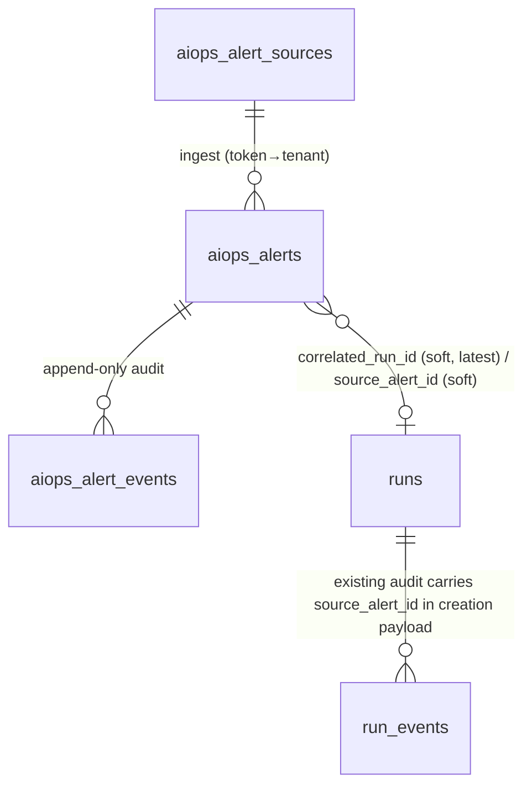

# AIOps 告警域 Spec：数据模型 + 域规则 + API 契约 (v0.1)

> 状态：v0.1 · **评审稿**（对应 PRD docs/aiops-alerts-prd.md v0.1；评审通过前不驱动实现）。
> 基线：repo @ `2503616`。工程形态对齐 Operations 线既有事实：`packages/operations-store`（port/adapter/fake 三方言基座）、`timeout-tick.ts` tick 纪律、`apps/main/src/cf-scheduler-jobs.ts` 注册形态、`packages/http-routes/src/operations/index.ts` BFF 路由面。
> 证据纪律：本文只引用已存在代码与已落地行为；"规划中"内容仅出现在阶段标注里。

## 1. 范围与阶段分界

| 项 | A1（域底座） | A2（工作面） | 明确不做 |
|---|---|---|---|
| 三表迁移 + 触发器镜像 | ✅ | — | — |
| 归一化器（alertmanager v2 / generic） | ✅ | — | Grafana/Zabbix/PagerDuty |
| 指纹去重 / episode 生命周期 / 过期 tick | ✅ | — | 自动触发规则、auto-resolve |
| ingest 鉴权（source token） | ✅ | — | OAuth 类 source 接入 |
| 告警源管理 API | ✅（token 一次性返回） | — | Console 化托管（开放问题 5） |
| Workspace 列表/详情/suppress/trigger-run | — | ✅ | 告警 SSE（PRD 裁决 8） |
| 度量预埋与还原 | ✅（事件+计数） | ✅（还原脚本/测试） | P3 看板 |

分阶段与 Operations 线一致：A1 后端闭环可独立验收（PRD §9 #1-#5），A2 用户闭环（#6-#9）。

## 2. 存储落位与仓库 Schema 惯例

- **落位**：与 Operations 六表同库同迁移面——main-node（SQLite/PG，`packages/db-schema` + drizzle 快照按 journal idx 命名）、CF 每 shard D1（`wrangler.test.jsonc` migrations 纪律）、PG（`oma-postgres` 双方言实证延续）。
- **迁移编号**：各店下一可用 journal idx（实证于 2026-08-18 生成）：D1 `0004_useful_dreaming_celestial`（apps/main/migrations，idx 4）、sqlite `0008_gray_trish_tilby`（apps/main-node/migrations-sqlite，idx 8）、PG `0009_odd_white_tiger`（apps/main-node/migrations，idx 9）。文件名后缀为 drizzle 随机词，稳定锚是 journal idx，快照按 idx 命名；测试以 `0004_*.sql` 前缀解析。
- **FK=OFF 纪律**：生产 D1 以 FK=OFF 运行，声明式 FK 一律配触发器镜像（对齐 0003 的 17 触发器纪律与 FK=OFF 证明套件）；跨聚合软引用（`source_alert_id` → `aiops_alerts`）**不建 FK、不建镜像**，完整性由服务层校验（裁决见 §11 I8）。
- **时间戳**：INTEGER ms epoch，与 Operations 表一致。
- **主键**：TEXT 前缀式（`asrc_` / `alert_` / `aev_` + 随机段），生成于服务层。

## 3. 实体全景与关系模型



- **聚合根**：`aiops_alert_sources`（租户边界入口）与 `aiops_alerts`（租户内实体）；`aiops_alert_events` 为告警附属 append-only 事实表。
- **租户所有权**（D0 §4 对齐）：三表均携带 `tenant_id`，子表经不可绕过的复合键继承（事件表以 `(tenant_id, alert_id)` 复合索引为唯一访问路径）；查询与后台任务（过期 tick）从可信上下文取 tenant，tick 经 shard 枚举（`forEachShardServices` 同款 seam）。
- **与 runs 的关系**：松耦合双向软引用——告警侧 `correlated_run_id`（最新关联 Run），Run 侧 `source_alert_id`（来源告警）；两侧均不建 FK。关联事实以事件为准（`run_triggered` 携带 run_id，索引可查全集）。

## 4. Schema 详细设计

### 4.1 `aiops_alert_sources` 聚合根表

| 列 | 类型 | 约束 | 说明 |
|---|---|---|---|
| id | TEXT | PK | `asrc_` 前缀 |
| tenant_id | TEXT | NOT NULL | 聚合根租户归属 |
| name | TEXT | NOT NULL | 展示名（租户内唯一，软约定） |
| type | TEXT | NOT NULL CHECK `type IN ('alertmanager','generic')` | 归一化器选择 |
| webhook_token_hash | TEXT | NOT NULL | sha256(token) hex；token 仅创建响应明文一次 |
| severity_mapping_json | TEXT | NOT NULL DEFAULT '{}' | 覆盖默认严重度映射（§7.3） |
| stale_after_seconds | INTEGER | NOT NULL DEFAULT 86400 | 过期 tick 阈值 |
| enabled | INTEGER | NOT NULL DEFAULT 1 | 停用即拒收（403） |
| created_at / updated_at | INTEGER | NOT NULL | ms epoch |

索引：`CREATE UNIQUE INDEX idx_asrc_token ON aiops_alert_sources(webhook_token_hash)`（token → source 单跳解析）；`(tenant_id)` 列表索引。

**反探测**：token 错误与 source 不存在同返回 401（信封镜像原 message，区分不了探测面）；source 存在但 `enabled=0` 返回 403（管理面语义，非探测面）。

### 4.2 `aiops_alerts` 告警聚合表（一行 = 一集 episode）

| 列 | 类型 | 约束 | 说明 |
|---|---|---|---|
| id | TEXT | PK | `alert_` 前缀 |
| tenant_id | TEXT | NOT NULL | 继承自 source（服务层写入，不信任上报方） |
| source_id | TEXT | NOT NULL REFERENCES aiops_alert_sources(id) | FK=OFF 镜像触发器 |
| fingerprint | TEXT | NOT NULL | hex(sha256(canonical labels))，算法见 §5.1 |
| status | TEXT | NOT NULL DEFAULT 'firing' CHECK `status IN ('firing','resolved','suppressed','expired')` | episode 状态机 |
| severity | TEXT | NOT NULL CHECK `severity IN ('critical','high','medium','low','info')` | 去重合并取最高（§5.2） |
| title | TEXT | NOT NULL | 归一化产物（AM: labels.alertname + instance 摘要） |
| labels_json | TEXT | NOT NULL | 最近一次上报的标签集（fingerprint 输入） |
| annotations_json | TEXT | NOT NULL DEFAULT '{}' | 最近一次上报的注解（含 runbook_url / description） |
| starts_at | INTEGER | NOT NULL | 监控侧起始时间（缺失用接收时间） |
| last_seen_at | INTEGER | NOT NULL | 去重合并前移 |
| occurrence_count | INTEGER | NOT NULL DEFAULT 1 | 风暴计数 |
| resolved_at | INTEGER | NULL | 监控侧信号写入 |
| correlated_run_id | TEXT | NULL | 最新关联 Run（软引用 runs.id，无 FK） |
| correlation_id | TEXT | NULL | 外部事件/工单号透传（CMDB/ITSM 连接器预留） |
| suppress_note | TEXT | NULL | suppress 时必填备注 |
| created_at / updated_at | INTEGER | NOT NULL | created_at = episode 首报时间（MTTR 起点） |

索引：
- **部分唯一索引（去重锚，三方言对齐）**：
  `CREATE UNIQUE INDEX idx_alert_active_fp ON aiops_alerts(tenant_id, fingerprint) WHERE status IN ('firing','suppressed');`
- `(tenant_id, status, severity, last_seen_at)` 列表复合索引（列表页过滤+排序）；
- `(tenant_id, source_id)` 溯源索引。

### 4.3 `aiops_alert_events` 审计与度量事件表（append-only）

| 列 | 类型 | 约束 | 说明 |
|---|---|---|---|
| id | TEXT | PK | `aev_` 前缀 |
| tenant_id | TEXT | NOT NULL | 复合键继承 |
| alert_id | TEXT | NOT NULL REFERENCES aiops_alerts(id) | FK=OFF 镜像触发器 |
| event_type | TEXT | NOT NULL CHECK（目录见 §10.1） | 九种，不含逐条去重 |
| actor | TEXT | NOT NULL | `system:ingest` / `system:expiry-tick` / 用户 actor（沿 Operations AuditActor 形态） |
| payload_json | TEXT | NOT NULL | 事件事实（severity 变更前后值、run_id、note 等） |
| created_at | INTEGER | NOT NULL | ms epoch |

索引：`(tenant_id, alert_id, created_at)`（时间线唯一访问路径）；`(tenant_id, event_type, created_at)`（度量提取）。

**不可变纪律**：无 UPDATE/DELETE 路径；触发器镜像之外追加防改触发器（UPDATE/DELETE → RAISE）。**此为超越项**：run_events 的 append-only 目前仅是服务层纪律（Base A 迁移只带 FK 镜像触发器，无防改触发器），alert_events 是本域第一个拿到库层强制的审计表（对齐 D0 append-only 例外条款：生命周期操作自身留审计）。

## 5. 指纹与去重算法

### 5.1 指纹（canonical fingerprint）

```
输入：归一化后的 label set（string→string，非字符串值转字符串）
排除：severity（严重度独立列，参与合并不参与指纹）
排序：key 字典序；canonical = JSON.stringify([[k1,v1],[k2,v2],...])
fingerprint = hex(sha256(canonical))
```

- AM 上报自带的 `fingerprint` 字段**不采用**（跨源一致性优先），作为注解透传保留；
- generic 源可显式传 `fingerprint` 覆盖（信任租户自配源；记录于开放问题 2 是否收紧）。

### 5.2 去重合并（活跃 episode 内）

一次 upsert 语义（单条语句、事务内）：

- **命中活跃行**（部分唯一索引冲突）：`occurrence_count+1`；`last_seen_at = max(旧, 接收时间)`；`severity = rank 更高者`；`labels_json/annotations_json = 本次上报值`；**不写事件**，除非 severity 提升 → 追加 `severity_escalated`（payload 含前后值）；
- **未命中**：INSERT 新 episode 行 + `ingested` 事件；
- **resolved/expired 后同指纹**：部分唯一索引不拦截 → 新 episode 行 + `ingested` 事件（`reopened` 不作为独立类型：新行即新集，PRD 裁决 4）；
- 实现须在**同一往返或同一事务**内区分 created / dedup-bumped / escalated 三态（SQLite `INSERT ... ON CONFLICT(tenant_id, fingerprint) WHERE status IN ('firing','suppressed') DO UPDATE ... RETURNING` 形态；PG `ON CONFLICT` 同目标列；exact SQL 由实现定，三态区分为测试义务 T2）。

### 5.3 严重度序

`critical(4) > high(3) > medium(2) > low(1) > info(0)`；合并与升级判定均按此序。

## 6. 状态机迁移矩阵与过期 tick

### 6.1 迁移矩阵（episode 内）

| from | 事件 | to | 触发者 | 审计 |
|---|---|---|---|---|
| — | 首报（新指纹 / 新集） | firing | system:ingest | ingested |
| firing | 重复上报 | firing | system:ingest | （计数；升级时 severity_escalated） |
| firing | 监控 resolved | resolved | system:ingest | resolved（payload: resolved_at, ends_at） |
| suppressed | 监控 resolved | resolved | system:ingest | resolved |
| firing | 手动抑制 | suppressed | 用户 | suppressed（payload: note） |
| suppressed | 取消抑制 | firing | 用户 | unsuppressed |
| firing | 过期 tick | expired | system:expiry-tick | expired（payload: stale_after_seconds, last_seen_at） |
| resolved / expired / suppressed | 任意 | （不变） | — | 非法迁移拒绝（4xx，信封镜像 message） |

- **resolved 只由监控信号驱动**（PRD 裁决 3）：手动 resolve API 不提供；
- `run_triggered / run_completed` 只写事件与关联列，**不参与状态迁移**（裁决 3/6）；
- 所有迁移为条件 UPDATE（`WHERE status = <期望旧态>` 按 affected-rows 判定，CAS 纪律与 run 状态机一致——对齐 run 模型 spec §5.3 的实现形态）。

### 6.2 过期 tick（工程形态 = runOperationsTimeoutTick 同款）

```
输入：service（shard 枚举）、nowMs
扫描：status='firing' AND (last_seen_at + source.stale_after_seconds*1000) < nowMs（JOIN sources）
迁移：条件 UPDATE → expired（RETURNING id, tenant_id）
事件：逐条 expired（actor=system:expiry-tick）
幂等：状态已迁移即不再命中；事件与迁移同事务
注册：main-node 复用既有 interval 调度器形态；CF 侧 register({name:'aiops-alert-expiry', cron: envCron(env,'AIOPS_ALERT_EXPIRY_CRON','* * * * *')}) 挂 cf-scheduler-jobs
```

## 7. 归一化器契约

### 7.1 alertmanager v2（A1）

输入（webhook 标准体）：

```json
{ "version": "v2", "alerts": [ { "status": "firing", "labels": {"alertname":"HighCPU","severity":"warning","instance":"10.0.0.1:9100"}, "annotations": {"description":"..."}, "startsAt":"2026-08-18T08:00:00Z", "endsAt":"0001-01-01T00:00:00Z", "generatorURL":"http://..." } ] }
```

映射：`status=firing|resolved`（resolved 且 endsAt 非零值 → 触发 §6.1 resolved 迁移）；`labels`（排除 severity 后入指纹）；`annotations` 原样；`startsAt`/`endsAt` ISO8601 → ms epoch（解析失败用接收时间，不拒收）；单请求批量上限 64 条（超出 400，开放问题 3）。

### 7.2 generic（A1）

```json
{ "alerts": [ { "title": "...", "severity": "high", "labels": {}, "annotations": {}, "starts_at": 1723968000000, "ends_at": null, "fingerprint": null } ] }
```

`severity` 直接取规范五档（非法值走映射表，再非法 → 'medium'）；`fingerprint` 可选覆盖（§5.1）。

### 7.3 严重度映射（AM 标签 → 规范五档）

默认表（大小写不敏感）：`critical|crit|p1 → critical`；`major|high|p2 → high`；`warning|minor|p3 → medium`；`info|informational|p4|debug → low`；**未命中 → medium**（保守中间档，开放问题 1）。source 级 `severity_mapping_json` 覆盖默认表（键为 AM 原值，值为五档）。

## 8. 接入鉴权与反探测

- **鉴权**：`Authorization: Bearer <token>` → sha256 → 命中 `aiops_alert_sources.webhook_token_hash`（唯一索引单跳）；token 缺失/错误/source 不存在 → **401**（信封镜像 message，与 stream ticket 门同款反探测姿态）；`enabled=0` → **403**；
- **CF 侧豁免**：authMiddleware 对 `POST /v1/workspace/alerts/ingest` 单路径豁免（比照 H-2 手术刀形态：方法+精确路径正则，非前缀整树）——豁免后该路由的**唯一权威是 source token**；
- **token 生命周期**：创建时生成（crypto 随机 ≥32 字节 urlsafe）、响应体一次性明文；轮换 = 新建 source 或（A2 增强）rotate API 作废旧 token；**不做**找回（丢失即轮换）；
- **限流**：ingest 挂 R9b 参数位（per-source 令牌桶建议值开放问题 4）；
- **tenant 归属**：tenant_id 一律取自 source 行，**不信任上报体任何字段**。

## 9. API 契约（workspace BFF 增量）

错误信封沿既有 errorEnvelope 纪律（4xx 镜像原 message）。响应字段命名 snake_case 对齐 Operations BFF（spec v0.4.x 既有形态）。

| # | 路由 | 鉴权 | 说明 |
|---|---|---|---|
| 1 | `POST /v1/workspace/alerts/ingest` | source token | 机器通道；批量处理；返回 `{accepted: n, episodes: {created: x, merged: y, resolved: z}}` 摘要 |
| 2 | `POST /v1/workspace/alert-sources` | 用户（管理员） | 创建；响应含一次性 `webhook_token` 明文 |
| 3 | `GET /v1/workspace/alert-sources` | 用户 | 列表；**永不**返回 token（仅 has_token 布尔） |
| 4 | `GET /v1/workspace/alerts?status=&severity=&source_id=&q=&limit=&cursor=` | 用户 | 列表默认窗口 7 天（开放问题 6）；cursor = `(last_seen_at, id)` 键集 |
| 5 | `GET /v1/workspace/alerts/:id` | 用户 | 详情 + 时间线（events 分页）+ 关联 Run 列表（自 run_triggered 事件聚合） |
| 6 | `POST /v1/workspace/alerts/:id/suppress` `{note}` | 用户 | note 必填；firing→suppressed |
| 7 | `POST /v1/workspace/alerts/:id/unsuppress` | 用户 | suppressed→firing |
| 8 | `POST /v1/workspace/alerts/:id/trigger-run` `{template_version_id, form_data}` | 用户 | 校验模板类别 ∈ {只读故障诊断, 受控变更规划}；走**既有** run 创建与审批门（SoD、plan_hash 绑定不豁免）；Run 创建上下文携带 `source_alert_id`；成功 → `correlated_run_id` 回填 + `run_triggered` 事件 |

路由实现落位：`packages/http-routes/src/operations/`（既有 operations 路由文件内增量，或同目录 alerts 子模块）；ingest 反代 CF/main-node 同构（双运行时一致性沿 F3 边缘对齐纪律）。

## 10. 审计事件目录与度量预埋

### 10.1 事件目录（CHECK 约束全集）

`ingested` / `severity_escalated` / `resolved` / `suppressed` / `unsuppressed` / `expired` / `run_triggered` / `run_completed`

（`reopened` 不设——新 episode 行即新集，见 §5.2。）

### 10.2 度量口径（P1 预埋、P3 看板）

| 指标 | 口径 | 数据源 |
|---|---|---|
| MTTR | `resolved_at − created_at`（episode 粒度） | alerts 行 |
| 认领延迟 | 首个 `run_triggered.created_at − alert.created_at` | 事件（未触发 = 未认领） |
| 风暴强度 | `occurrence_count` 分布 | alerts 行 |
| 升级轨迹 | `severity_escalated` 序列 | 事件 payload |

## 11. 实现不变量（A1/A2 验收的测试义务）

| # | 不变量 |
|---|---|
| I1 | 迁移三方言一致；FK=OFF 套件下 bogus source_id/alert_id 写入被镜像触发器拒绝（0003 纪律复刻） |
| I2 | 1000 条同指纹风暴 = 1 行、occurrence_count=1000、severity 取最高、last_seen_at 为末条；created/merged/escalated 三态可区分 |
| I3 | partial unique index 三方言行为一致：已存在活跃行时绕过服务层的裸 INSERT 被数据库拒绝（负向 SQL 测试） |
| I4 | resolved 后同指纹再 firing = 新 episode 行；suppressed 不拦截新集 |
| I5 | 跨租户负向：token A 的租户无法经任何用户路由看到租户 B 的 source/告警；ingest 的 tenant 一律取自 source 行 |
| I6 | 过期 tick：stale firing → expired 留审计；幂等重跑零重复；disabled source 的告警照常过期 |
| I7 | 归一化 golden vectors：AM v2 / generic 各≥3 组（含 resolved、severity 映射、批量）快照断言 |
| I8 | `source_alert_id`（runs 新增可空列，三店 0004/0008/0009 一并加，配 `idx_runs_tenant_source_alert` 反查索引）与 `correlated_run_id` 为软引用：无 FK；服务层校验存在性与租户一致性；Run 详情可一跳回告警 |
| I9 | trigger-run 不豁免任何既有门：SoD 冲突仍拒、plan_hash 变化仍失效审批、超时仍永不自动批准（复跑既有审批测试面 + alert 上下文断言） |
| I10 | append-only：UPDATE/DELETE aiops_alert_events 被防改触发器拒绝（SQLite/D1 `trg_aev_no_update`/`trg_aev_no_delete`，PG plpgsql 同名双触发器；超越 run_events 现状——后者无库层防改） |

## 12. 开放问题清单（实施期收口，不阻塞评审）

1. 未映射严重度默认 `medium` 是否改为 source 级可配默认档；
2. generic 源显式 fingerprint 覆盖是否收紧为白名单开关；
3. ingest 批量上限 64 的定值与超限语义（400 vs 413 vs 截断+告警）；
4. per-source 限流参数（R9b 对齐：速率/突发建议值待压测）；
5. 告警源管理最终归宿（Workspace 托管 vs Console 化）；
6. 列表默认窗口 7 天与最大回看深度；
7. token rotate API 是否进 A2（当前裁决：丢失即新建 source）。
